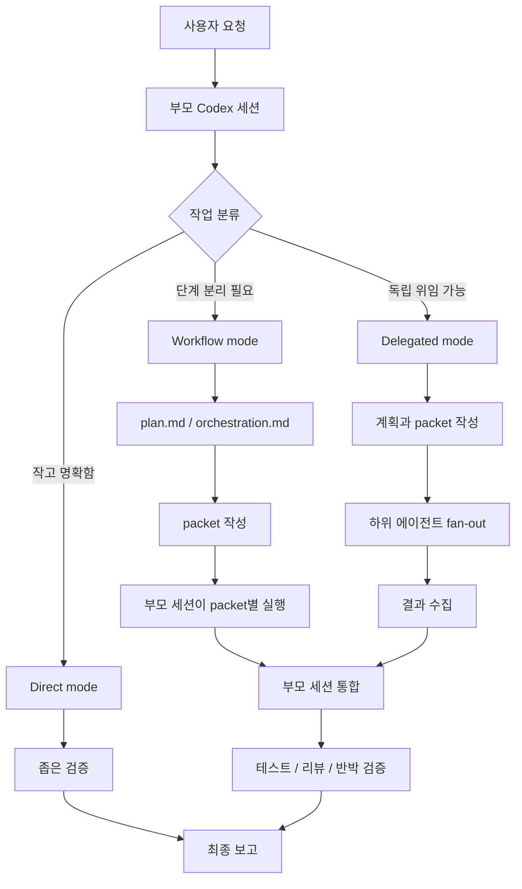

# Ultracode

Ultracode는 Codex에서 복잡한 개발 작업을 더 안전하게 처리하기 위한
멀티 에이전트 워크플로우 스킬셋입니다.

작업을 한 번에 밀어붙이는 대신, 부모 세션이 목표를 정리하고 일을 나눈 뒤
필요한 경우 하위 에이전트에게 위임하고, 다시 결과를 검증해서 통합하게 만듭니다.

이 저장소는 Claude Code에서 쓰이던 Ultracode와 workflow 운영 아이디어를 참고해,
Codex의 skill/subagent 환경에 맞게 다시 구성한 버전입니다. 공식 이식본이나
Claude Code Workflow 런타임 복제는 아니며, 같은 문제의식을 Codex 방식으로
재해석한 스킬셋입니다.

```text
요청
-> 작업 분류
-> 계획
-> 조사/구현/검증으로 분해
-> 가능한 경우 하위 에이전트 위임
-> 부모 세션이 증거와 테스트로 통합
-> 최종 보고
```

## 이 스킬셋은 무엇인가

Ultracode는 실행 파일이나 별도 런타임이 아닙니다.

- Codex가 읽는 `SKILL.md` 기반 스킬셋입니다.
- 복잡한 작업을 계획, 분해, 위임, 검증하는 운영 규칙입니다.
- Codex의 native agent, slash command, MCP, review, sandbox 정책을 조합해 사용합니다.
- 명시적으로 `$ultracode`를 호출할 때만 쓰는 것을 기본으로 합니다.

Ultracode가 제공하지 않는 것도 분명합니다.

- 공식 OpenAI, Claude, Google 기능이 아닙니다.
- Claude Code Workflow 런타임을 구현하지 않습니다.
- JavaScript/Python runner를 제공하지 않습니다.
- MCP server, 브라우저 자동화 서버, 배포 도구를 포함하지 않습니다.

## 왜 필요한가

작은 수정은 그냥 직접 처리하는 편이 낫습니다.

예를 들어 오타 수정, 파일 하나 요약, 명령 하나 실행 같은 일에 Ultracode를 쓸
필요는 없습니다.

Ultracode는 다음처럼 놓치는 비용이 큰 작업에 맞습니다.

- 저장소 전체 구조를 먼저 이해해야 하는 기능 구현
- 재현이 어렵거나 원인 후보가 여러 개인 복잡한 디버깅
- 스펙 문서가 있고 구현 범위가 긴 기능 개발
- 인증, 결제, 데이터 마이그레이션처럼 실패 비용이 큰 변경
- 여러 파일, 테스트, 문서가 함께 바뀌는 작업
- 풀 리퀘스트 전 독립적인 검증이 필요한 변경
- "정말 빠진 게 없는지" 반박 관점으로 확인해야 하는 검증

핵심 가치는 속도가 아니라 신뢰도입니다. 한 세션이 혼자 결론을 내리지 않고,
작업을 나누고 독립 검증을 거친 뒤 부모 세션이 책임지고 합칩니다.

## 구성 원리

Ultracode의 중심은 "부모 세션이 책임지고, 필요한 일만 하위 에이전트에 나눈다"는
구조입니다. 하위 에이전트가 많아지는 것이 목표가 아니라, 작업을 분해하고 서로
다른 관점으로 검증하는 것이 목표입니다.



구성 요소는 다음처럼 나뉩니다.

- **부모 세션:** 작업 분류, 계획, 통합, 최종 판단을 담당합니다.
- **packet:** 조사, 구현, 검증처럼 독립적으로 수행할 수 있는 작은 작업 단위입니다.
- **하위 에이전트:** packet을 받아 독립적으로 조사하거나 검증합니다. 쓸 수 없으면 부모 세션이 단계별로 대체 실행합니다.
- **artifact:** `plan.md`, `orchestration.md`, `state.json`, packet/result 파일처럼 실행 과정을 남기는 기록입니다.
- **반박 검증:** 나온 결론이 틀렸다고 가정하고 다시 확인하는 단계입니다.

Codex에서 native subagent가 가능하면 `Delegated mode`가 가장 완전한 형태입니다.
그 기능이 없거나 막혀 있으면 `Workflow mode`로 같은 절차를 단일 세션 안에서
재현합니다. 아주 작은 작업은 `Direct mode`로 바로 처리합니다.

## 저장소 구성

```text
./
  README.md
  ultracode/
    SKILL.md
    agents/
      openai.yaml
    references/
      approval-gates.md
      eval-contracts.md
      execution-examples.md
      forward-testing.md
      js-runner.md
      packet-schema.md
```

| 경로 | 역할 |
| --- | --- |
| `README.md` | 처음 읽는 공개용 소개 문서입니다. |
| `ultracode/SKILL.md` | 실제 스킬 규칙입니다. Codex가 따르는 기준 문서입니다. |
| `ultracode/agents/openai.yaml` | Codex 표시 이름, 기본 프롬프트, 명시 호출 정책을 담습니다. |
| `ultracode/references/` | packet 형식, 승인 gate, 실행 예시, 검증 계약 등 상세 규칙을 담습니다. |

## 설치 방법

프로젝트 하나에서만 쓰려면 대상 프로젝트의 `.agents/skills/` 아래로 복사합니다.

```bash
mkdir -p your-project/.agents/skills
cp -R ultracode your-project/.agents/skills/ultracode
```

여러 프로젝트에서 개인 스킬처럼 쓰려면 사용자 스킬 폴더로 복사합니다.

```bash
mkdir -p ~/.agents/skills
cp -R ultracode ~/.agents/skills/ultracode
```

설치 후 새 Codex 세션을 열고 명시적으로 호출합니다.

```text
$ultracode로 간헐적으로 실패하는 로그인 버그를 디버깅해줘.
```

`ultracode/agents/openai.yaml`은 `allow_implicit_invocation: false`를 사용합니다.
즉, 평소 작업에 자동으로 끼어들지 않고 사용자가 `$ultracode`, `ultracode`,
`ultra code`처럼 명시적으로 부를 때 사용하는 방식이 기본입니다.

## 어떤 작업에 잘 맞나

Ultracode는 "AI에게 많이 시키는 방법"이 아니라 "복잡한 일을 놓치지 않게
쪼개는 방법"에 가깝습니다.

| 상황 | Ultracode가 하는 일 | 기대 결과 |
| --- | --- | --- |
| 복잡한 디버깅 | 원인 후보를 나누고, 재현 경로와 반박 검증을 분리합니다. | 원인, 수정 범위, 회귀 검증이 함께 남습니다. |
| 스펙 문서 기반 구현 | 스펙을 체크리스트로 나누고, 코드와 테스트에 대응시킵니다. | 구현 누락과 스펙 불일치를 줄입니다. |
| 위험한 모듈 변경 | 조사, 구현, 보안/회귀 검증을 분리합니다. | 변경 이유와 검증 근거가 명확해집니다. |
| 풀 리퀘스트 전 검증 | 변경 파일을 기준으로 독립 리뷰를 수행합니다. | 차단 이슈와 남은 위험을 먼저 확인합니다. |
| 레거시 코드 수정 | 기존 흐름을 먼저 추적하고, 영향 범위를 나눈 뒤 구현합니다. | 수정 전제와 영향 범위가 명확해집니다. |

## 사용 방법

가장 좋은 요청은 목표, 범위, 모드, 제약, 검증 방법을 함께 적는 것입니다.

```text
$ultracode로 <목표>를 수행해줘.
범위: <파일, 모듈, 저장소 범위>.
모드: <읽기 전용 검증 | 계획 먼저 | 조사 후 구현 | 검증만>.
제약: <수정 금지, 커밋 금지, 넓은 변경 전 확인 등>.
필수 검증: <테스트, 빌드, 린트, 문서 일치 검증 등>.
출력: <원하는 결과 형식>.
```

### 풀 리퀘스트 전 위험 변경 검증

```text
$ultracode로 결제 모듈 변경 사항을 풀 리퀘스트 전에 검증해줘.
범위: 변경된 파일, 결제 관련 테스트, 결제 API 경계.
모드: 검증만.
제약: 파일을 수정하지 말고 커밋하지 말 것.
필수 검증: 누락된 예외 케이스, 보안 위험, 회귀 가능성, 테스트 근거.
출력: 차단 이슈, 수정 권장 사항, 남은 위험.
```

### 복잡한 디버깅

```text
$ultracode로 간헐적으로 실패하는 로그인 버그를 디버깅해줘.
범위: 인증 모듈, 세션 처리, 로그인 관련 테스트.
모드: 조사 후 구현.
제약: 원인 가설을 먼저 정리하고, 대규모 수정 전에는 확인할 것.
필수 검증: 재현 경로, 로그나 테스트 근거, 수정 후 회귀 테스트.
출력: 원인, 수정 범위, 변경 내용, 검증 결과, 남은 위험.
```

### 스펙 문서 기반 긴 구현

```text
$ultracode로 docs/payment-v2-spec.md 기준으로 결제 v2를 구현해줘.
범위: 결제 도메인, API, 테스트, 관련 문서.
모드: 조사 후 구현.
제약: 스펙과 다른 기존 동작은 먼저 보고하고, 커밋하거나 푸시하지 말 것.
필수 검증: 스펙 항목별 구현 여부, 단위 테스트, 통합 테스트, 보안 리뷰.
출력: 스펙 체크리스트, 변경된 파일, 검증 결과, 미해결 항목.
```

### 구현 전 구조 파악

```text
$ultracode로 현재 인증 흐름이 어떻게 동작하는지 파악해줘.
범위: 인증 모듈과 관련 미들웨어.
모드: 계획 먼저.
제약: 아직 파일은 수정하지 말 것.
필수 검증: 라우트에서 저장소 계층까지 요청 흐름을 추적할 것.
출력: 위험 요소가 포함된 구현 계획.
```

### 구현과 검증

```text
$ultracode로 먼저 구조를 파악한 뒤 요청한 기능을 구현해줘.
범위: 체크아웃 흐름.
모드: 조사 후 구현.
제약: 대규모 재작성 전에는 먼저 확인하고, 커밋하거나 푸시하지 말 것.
필수 검증: 단위 테스트, 통합 테스트, 보안 리뷰.
출력: 요약, 변경된 파일, 검증 결과.
```

### 변경 후 독립 검증

```text
$ultracode로 풀 리퀘스트 전에 현재 변경 사항을 검증해줘.
범위: 변경된 파일.
모드: 검증만.
제약: 치명적이고 명확한 문제가 아니라면 파일을 수정하지 말 것.
필수 검증: 테스트, 문서 일치 여부, 반박 관점 리뷰.
출력: 차단 이슈를 먼저 쓰고, 그다음 남은 위험을 정리.
```

## 실행 모드

Ultracode는 작업 크기와 환경에 따라 세 가지 방식으로 동작합니다.

| 모드 | 언제 쓰는가 | 동작 |
| --- | --- | --- |
| Direct mode | 작고 명확한 작업 | 부모 세션이 바로 처리하고 좁게 검증합니다. |
| Workflow mode | 하위 에이전트가 없지만 단계 분리가 필요한 작업 | 부모 세션이 계획, 실행, 검증 단계를 나눠 진행합니다. |
| Delegated mode | 하위 에이전트를 쓸 수 있는 복잡한 작업 | 조사, 구현, 검증 packet을 하위 에이전트에 나누고 부모 세션이 통합합니다. |

Codex에서 native delegation이 가능하면 비중 있는 작업은 Delegated mode가 기본입니다.
가능하지 않으면 단일 세션 workflow로 대체하고, 왜 위임하지 않았는지 최종 보고에 남깁니다.

## 안전 원칙

Ultracode는 강한 작업 모드이기 때문에 부작용을 보수적으로 다룹니다.

- 명시 호출 없이 자동 실행하지 않습니다.
- 커밋, 푸시, 배포, 게시, 외부 리소스 변경은 사용자가 명시적으로 요청해야 합니다.
- 삭제, 대규모 재작성, 인증 정보 변경, 운영 데이터 접근은 먼저 확인합니다.
- 하위 에이전트 결과를 그대로 믿지 않고 부모 세션이 증거와 테스트로 검증합니다.
- 검증하지 못한 항목은 최종 보고에 그대로 밝힙니다.

## 언제 쓰지 말아야 하나

다음 작업에는 Ultracode가 과합니다.

- 오타 하나 수정
- 단일 파일의 작은 문구 변경
- 이미 범위와 원인이 확실한 한 줄 수정
- 단순 명령 실행
- 빠른 대화형 질문

이런 경우에는 일반 Codex 흐름으로 직접 처리하는 편이 더 빠르고 명확합니다.

## 더 자세히 읽기

처음 읽는 순서는 다음을 추천합니다.

1. `README.md`
2. `ultracode/SKILL.md`
3. `ultracode/references/execution-examples.md`
4. `ultracode/references/js-runner.md`
5. `ultracode/references/packet-schema.md`
6. `ultracode/references/approval-gates.md`
7. `ultracode/references/eval-contracts.md`
8. `ultracode/references/forward-testing.md`

README는 입문용입니다. 실제 에이전트가 따라야 하는 운영 규칙은
`ultracode/SKILL.md`가 기준입니다.
