# Ultracode

Language: [한국어](#ultracode) | [English](#english)

Ultracode는 Codex에서 복잡한 개발 작업을 더 안전하게 처리하기 위한
멀티 에이전트 워크플로우 스킬셋입니다.

작업을 한 번에 밀어붙이는 대신, 부모 세션이 목표를 정리하고 일을 나눈 뒤
필요한 경우 하위 에이전트에게 위임하고, 다시 결과를 검증해서 통합하게 만듭니다.

이 저장소는 Claude Code에서 쓰이던 Ultracode와 workflow 운영 아이디어를 참고해,
Codex의 skill/subagent 환경에 맞게 다시 구성한 버전입니다. 공식 이식본이나
Claude Code Workflow 런타임 복제는 아니며, 같은 문제의식을 Codex 방식으로
재해석한 스킬셋입니다.

```text
요청
-> 작업 분류
-> 계획
-> 조사/구현/검증으로 분해
-> 가능한 경우 하위 에이전트 위임
-> 부모 세션이 증거와 테스트로 통합
-> 최종 보고
```

## 이 스킬셋은 무엇인가

Ultracode는 실행 파일이나 별도 런타임이 아닙니다.

- Codex가 읽는 `SKILL.md` 기반 스킬셋입니다.
- 복잡한 작업을 계획, 분해, 위임, 검증하는 운영 규칙입니다.
- Codex의 native agent, slash command, MCP, review, sandbox 정책을 조합해 사용합니다.
- 명시적으로 `$ultracode`를 호출할 때만 쓰는 것을 기본으로 합니다.

Ultracode가 제공하지 않는 것도 분명합니다.

- 공식 OpenAI, Claude, Google 기능이 아닙니다.
- Claude Code Workflow 런타임을 구현하지 않습니다.
- JavaScript/Python runner를 제공하지 않습니다.
- MCP server, 브라우저 자동화 서버, 배포 도구를 포함하지 않습니다.

## 왜 필요한가

작은 수정은 그냥 직접 처리하는 편이 낫습니다.

예를 들어 오타 수정, 파일 하나 요약, 명령 하나 실행 같은 일에 Ultracode를 쓸
필요는 없습니다.

Ultracode는 다음처럼 놓치는 비용이 큰 작업에 맞습니다.

- 저장소 전체 구조를 먼저 이해해야 하는 기능 구현
- 재현이 어렵거나 원인 후보가 여러 개인 복잡한 디버깅
- 스펙 문서가 있고 구현 범위가 긴 기능 개발
- 인증, 결제, 데이터 마이그레이션처럼 실패 비용이 큰 변경
- 여러 파일, 테스트, 문서가 함께 바뀌는 작업
- 풀 리퀘스트 전 독립적인 검증이 필요한 변경
- "정말 빠진 게 없는지" 반박 관점으로 확인해야 하는 검증

핵심 가치는 속도가 아니라 신뢰도입니다. 한 세션이 혼자 결론을 내리지 않고,
작업을 나누고 독립 검증을 거친 뒤 부모 세션이 책임지고 합칩니다.

## 왜 ultracode를 쓰는가

> **한 줄 요약.** 보통의 코드 작업에서는 일반 codex와 점수가 똑같습니다(이건 솔직히 인정합니다).
> 대신 "코드 전체를 훑어 빠뜨리지 않고 다 찾아야 하는" 작업에서는 더 많이 찾아냅니다. 그 차이를
> 이 저장소의 벤치마크로 실제로 측정했습니다.

### ultracode가 하는 일 (비유로)

어려운 문제를 풀 때 ultracode는 두 가지 방법을 씁니다.

- **한 명이 더 오래 고민하게 하기** — Codex의 `xhigh` 추론 모드(설정 키 `model_reasoning_effort`). Codex 기본값은 medium이고, 지연에 둔감한 어려운 작업에 xhigh를 권장합니다.
- **여러 명에게 나눠 맡기고 합치기** — 작업을 여러 AI(서브에이전트)에 쪼개 각자 맡은 부분을 깊게 본 뒤 결과를 합칩니다. 서브에이전트는 Codex의 native 기능입니다(내장 에이전트 `default`·`worker`·`explorer`). 이 "나눠서 맡기고 합치는" 방식을 dynamic workflow(멀티에이전트)라고 부릅니다.

두 방법의 원리는 같습니다. **AI가 생각을 더 많이 할수록(= 더 많은 "토큰"을 쓸수록) 결과가 좋아진다**
는 것입니다. (연구에 따르면 성능 차이의 약 80%가 "토큰을 얼마나 썼는가"로 설명됩니다.)

> **⚠️ 출처를 구분합니다.** `xhigh` 추론 모드와 서브에이전트는 **Codex의 native 기능**입니다(아래 Codex 공식 문서). 다만 이를 "스킬"로 조직하는 워크플로 설계는 **Claude Code Workflow를 참고**한 것이고, "+90.2%" 같은 수치는 **Anthropic 멀티에이전트 연구의 결과**이지 codex-ultracode가 Codex에서 다시 측정한 값이 아닙니다. 아래 "이 저장소가 직접 측정한 것"만 우리 벤치마크 결과입니다.

<details>
<summary>🔬 전문가용 — AI 엔지니어를 위한 심화</summary>

두 엔진은 **test-time compute**(추론 시점 연산)를 키우는 두 축입니다. 엔진 1(`xhigh`)은 한 정책의 *순차적* 사고 깊이(reasoning-token 예산)를 늘리고, 엔진 2(서브에이전트)는 *병렬* 표본 수와 유효 컨텍스트를 늘립니다. Anthropic이 보고한 "토큰 사용량이 분산의 ~80% 설명"은 test-time scaling 곡선의 한 단면으로, 두 축이 같은 곡선을 다른 방향으로 탑니다. 단 축별 한계 효용은 작업의 **분해 가능성**과 **검증 가능성**에 따라 급변하며(아래 측정) 무조건 단조 증가가 아닙니다. 비용 모델: 서브에이전트는 컨텍스트를 공유하지 않아 조정 비용과 per-agent 토큰이 곱으로 늘어 약 15배 토큰(Anthropic 보고치)입니다.

</details>

### 이 저장소가 직접 측정한 것

먼저 용어 세 개만 쉽게 풀어둡니다.

- **recall(찾아낸 비율):** 숨겨 둔 버그 중 실제로 몇 개나 찾았는지. 높을수록 "놓친 게 적다".
- **헛알람(false positive):** 사실은 문제가 아닌데 "문제다"라고 잘못 보고한 것. 적을수록 좋다.
- **숨겨 둔 정답(held-out):** 채점할 때만 쓰는, AI에게는 보여 주지 않는 정답. 예를 들어 채점 테스트가
  요구하는 *정확한 에러 문구* 같은 것.

#### 1. 보통의 코드 수정 → 점수가 똑같습니다 (인정)

업계 표준 시험인 SWE-bench Pro 12문제를 실제 채점기로 돌려 보면, ultracode를 켜든 끄든 결과가
같았습니다. 12개 중 같은 3개를 맞히고, 틀린 문제까지 똑같았습니다.

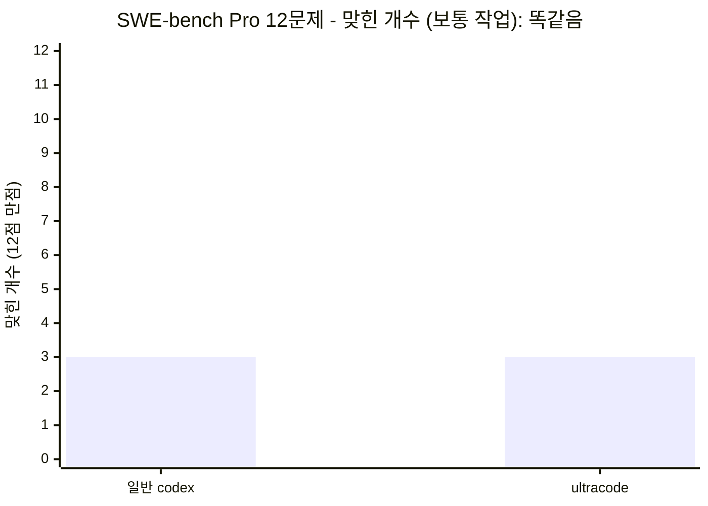

| 방법 | 맞힌 개수 |
| --- | --- |
| 일반 codex | 3 / 12 |
| ultracode | 3 / 12 (똑같음, 맞힌 문제까지 동일) |

근거: [`bench/REPORT.md` 사이클 3b·4](bench/REPORT.md) · 원자료
[`bench/results_pro12.json`](bench/results_pro12.json), [`bench/results_orch12.json`](bench/results_orch12.json)

**왜 차이가 없을까요?** 이 문제들을 틀리는 이유는 "채점 테스트가 요구하는 정확한 에러 문구" 같은
*숨겨 둔 정답*을 못 맞혀서인데, 그 정답은 AI에게 주어지지 않습니다. **주어지지 않은 정보는 AI를 여러
명 붙여도 알아낼 수 없습니다.** 그래서 보통의 단일 수정 작업에서는 **ultracode가 토큰만 더 쓰고 점수는
그대로입니다.** 이 점은 솔직하게 인정합니다.

<details>
<summary>🔬 전문가용 — AI 엔지니어를 위한 심화</summary>

이 동률은 오케스트레이션 실패가 아니라 **정보 이론적 상한**입니다. SWE-bench Pro의 판정 신호(FAIL_TO_PASS의 `assert.EqualError` 등)는 에이전트의 관측 입력에 존재하지 않는 held-out 사양이라, 과제가 입력만으로 과소결정(underdetermined)됩니다. 팬아웃·적대 검증·best-of-N은 탐색으로 줄일 수 있는 epistemic 불확실성에는 듣지만, 여기 실패는 줄일 수 없는 aleatoric 사양 모호성입니다. best-of-N도 선택을 위한 **유효한 in-distribution oracle**(예: 풍부한 PASS_TO_PASS)이 있어야 작동하는데 Pro 인스턴스는 그게 비어 있는 경우가 많습니다(flipt `pass_to_pass=[]`). flipt gold patch 대조로 확인: 에이전트는 의미상 동치지만 어휘가 다른 에러 문자열을 내 byte-exact 매칭에 실패했습니다.

</details>

#### 2. 코드 전체에서 결함을 빠짐없이 찾기 → 여기서 앞섭니다 (벤치로 증명)

반대로 "하나라도 빠뜨리면 실패"인 작업에서는 ultracode가 더 많이 찾아냅니다. 일부러 버그를 심어 둔
코드베이스 3개(버그 합계 46개)에서, **한 명이 한 번에 훑기**와 **여러 AI로 나눠 훑고 합치기**를
비교했습니다.

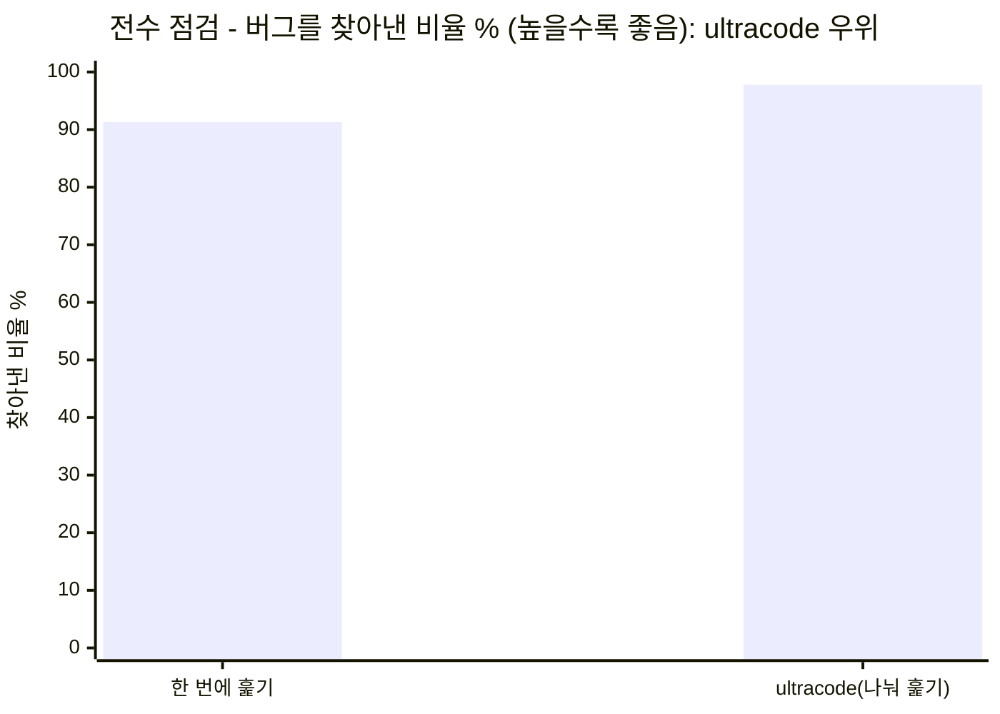

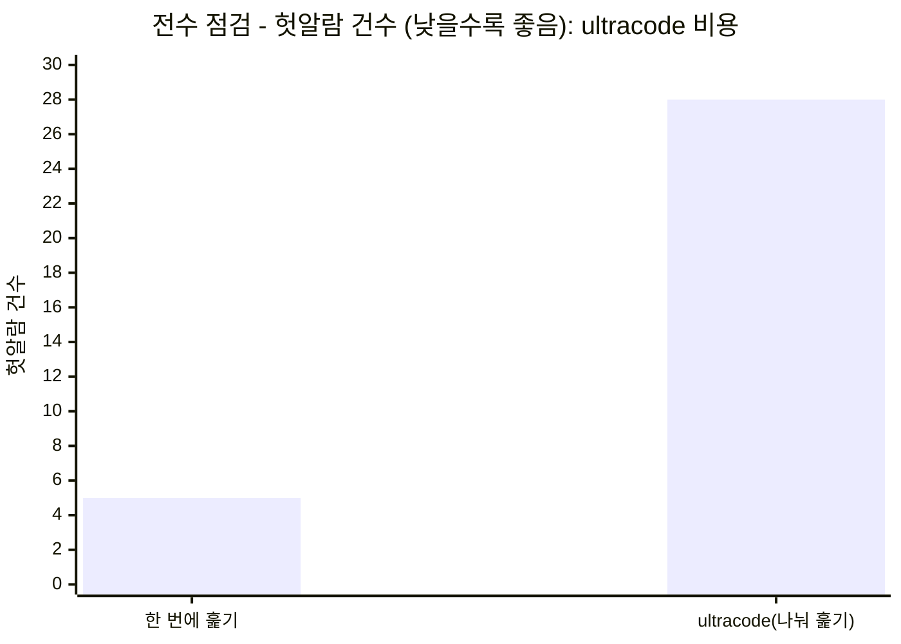

| 지표 | 한 번에 훑기 | ultracode(나눠 훑기) | 뜻 |
| --- | --- | --- | --- |
| 찾아낸 비율(recall) | 46개 중 42개(91.3%) | 46개 중 45개(97.8%) | ultracode가 **버그를 덜 놓칩니다** |
| 헛알람(false positive) | 5건 | 28건 | ultracode는 **헛알람이 더 많습니다** |

근거: [`bench/REPORT.md` 사이클 5](bench/REPORT.md)

**쉽게 풀면 이렇습니다.** 한 명이 혼자 훑으면 "이만하면 됐다" 하고 미묘한 버그를 놓치곤 합니다.
일을 여러 AI에게 나눠 맡기면 그 놓친 것까지 잡아내서, **버그를 찾아낸 비율이 91.3%에서 97.8%로
올랐습니다**(코드베이스 3개 전부에서 더 잘 찾았습니다). 다만 **그 대가로 헛알람이 5건에서 28건으로
늘었습니다.** 즉 ultracode의 장점은 "빠뜨리지 않는 것", 비용은 "확인해야 할 헛알람이 늘어나는 것"
입니다. 그리고 이 장점은 *버그가 미묘할 때만* 나타납니다. SQL 주입처럼 한눈에 보이는 버그는 한 번
훑기로도 다 잡힙니다.

> **Codex 문서와도 일치합니다**. Codex 공식 서브에이전트 문서는 서브에이전트가 "코드베이스 탐색이나 여러 비슷한 항목을 감사하는 것처럼 고도로 병렬적인 작업"에 적합하고, "서브에이전트 워크플로는 단일 에이전트 실행보다 토큰을 더 쓴다"고 설명합니다. 이는 우리 벤치마크의 두 결과 — 전수 점검에서 버그를 더 잘 찾음, 그리고 토큰·헛알람 비용 증가 — 와 정확히 들어맞습니다.

<details>
<summary>🔬 전문가용 — AI 엔지니어를 위한 심화</summary>

이는 탐지 과제의 **recall–precision 트레이드오프**입니다. 팬아웃은 per-chunk 주의를 유지해 단일 패스의 satisficing(조기 종료)과 attention decay를 완화하여 recall을 올리지만, 완전성 비평은 false-discovery rate도 함께 끌어올립니다(이 크기대에선 F1이 오히려 solo 우위). 최적 동작점은 **비용 비대칭**이 결정합니다 — miss 비용이 triage 비용보다 훨씬 크면(보안·규정 감사) 고-recall 설정이 정당하고, 반대면 solo가 낫습니다. 그래서 SKILL은 breadth 팬아웃 산출을 보고 전에 **생성기/검증기 분리**(적대 검증 게이트, 기본값=문제 아님)로 통과시켜 precision 세금을 일부 환원합니다.

</details>

<details>
<summary>📋 벤치마크 상세 — 설정 · 해결 인스턴스 · 재현 정보</summary>

**측정 설정**

- **사이클 1–4 (SWE-bench Pro A/B):** base = `codex` CLI **0.133.0**. 모델과 reasoning effort를 하니스에서 **고정하지 않음** → codex 기본값(문서상 medium) 사용. 생성 타임아웃 420–600초, `approval_policy="never"`, `workspace-write`. 채점 = Modal에서 공식 Scale 하니스 `swe_bench_pro_eval.py`(`jefzda` 이미지) 실행, resolved = FAIL_TO_PASS ∪ PASS_TO_PASS 전부 통과.
- **사이클 5–6 (전수 감사 recall):** 양 arm 모두 **Claude Opus 4.8**(세션 모델), effort = **xhigh**(세션 `/effort ultracode`; 워크플로 서브에이전트는 메인 루프 모델·effort를 상속). 별도 에이전트가 blind 채점.
- 데이터셋: `ScaleAI/SWE-bench_Pro` (test split), strided n=12. 감사 픽스처: `bench/recall/fixtures/`.

**SWE-bench Pro 12문제 — 무엇을 풀었나** (solo·orch 결과가 instance별로 완전히 동일)

| 인스턴스 | repo | 언어 | solo | orch |
| --- | --- | --- | :-: | :-: |
| NodeBB-04998908 | NodeBB/NodeBB | js | ✅ | ✅ |
| openlibrary-92db3454 | internetarchive/openlibrary | python | ✅ | ✅ |
| qutebrowser-34a13afd | qutebrowser/qutebrowser | python | ✅ | ✅ |
| flipt-c6a7b1fd | flipt-io/flipt | go | ❌ | ❌ |
| navidrome-8d56ec89 | navidrome/navidrome | go | ❌ | ❌ |
| openlibrary-7f6b722a | internetarchive/openlibrary | python | ❌ | ❌ |
| openlibrary-910b0857 | internetarchive/openlibrary | python | ❌ | ❌ |
| webclients-0200ce0f | protonmail/webclients | ts | ❌ | ❌ |
| webclients-e9677f6c | protonmail/webclients | ts | ❌ | ❌ |
| tutanota-db90ac26 | tutao/tutanota | ts | ❌ | ❌ |
| ansible-5e88cd99 | ansible/ansible | python | ⬜ 빈 패치 | n/a |
| ansible-7e1a3476 | ansible/ansible | python | ⬜ 빈 패치 | n/a |

해결 **3/12** (NodeBB, openlibrary-92db3454, qutebrowser-34a13). solo·orch 동일. ansible 2개는 repo가 과대해 타임아웃 캡 안에서 양 arm 모두 빈 패치 → 대칭 제외.

**전수 감사 recall — 픽스처별** (사이클 5, 같은 모델/effort 양 arm)

| 픽스처 (도메인) | 심은 버그 | solo recall | orch recall | solo FP | orch FP |
| --- | :-: | :-: | :-: | :-: | :-: |
| utils (일반) | 18 | 15/18 | 17/18 | 5 | 16 |
| http (웹) | 14 | 14/14 | 14/14 | 0 | 8 |
| collections (자료구조) | 14 | 13/14 | 14/14 | 0 | 4 |
| **합계** | **46** | **42 (91.3%)** | **45 (97.8%)** | **5** | **28** |

사이클 6은 같은 46버그를 24파일(188줄)로 합쳐 측정(solo 43/46, orch 44/46) — 이점 미미. 사이클 7은 같은 24파일을 13,460줄로 키워 측정: **solo 32/46(69.6%) vs 팬아웃 44/46(95.7%) — +12버그**(부피가 클수록 이점↑). **effort × arm 매트릭스 (SWE-bench Pro 10인스턴스, ansible 제외)**

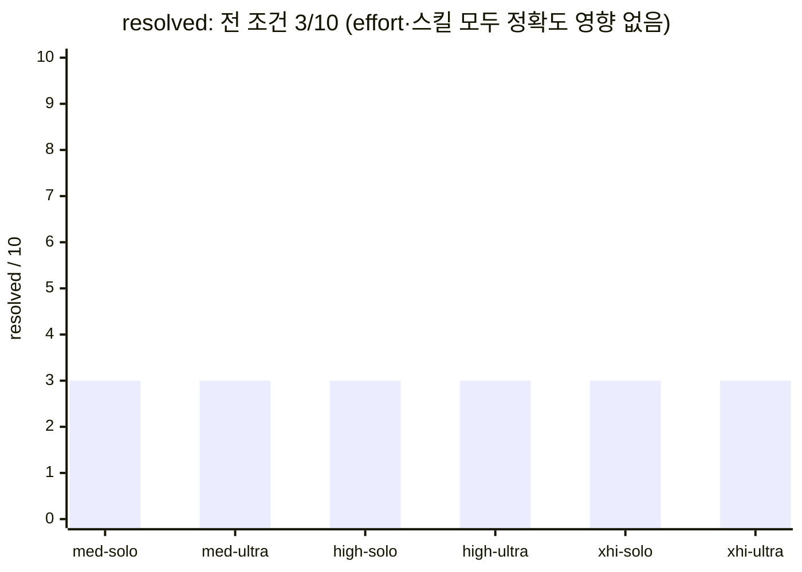


| effort | arm | resolved | 평균 토큰(total) |
| --- | --- | :-: | --: |
| medium | solo | 3/10 | 1.37M |
| medium | ultracode | 3/10 | 1.49M |
| high | solo | 3/10 | 1.82M |
| high | ultracode | 3/10 | 2.13M |
| xhigh | solo | 3/10 | 3.17M |
| xhigh | ultracode | 3/10 | 3.10M |

6개 조건 전부 **resolved 3/10, 같은 인스턴스**. effort를 medium→xhigh로 올리면 토큰은 약 2.3배 늘지만 정확도는 그대로고, ultracode도 모든 effort에서 solo와 동률(토큰만 paired 1.08~1.16배 더). Pro 실패는 held-out 정보 문제라 추론을 더 해도(effort↑), 스킬을 줘도 못 푼다 — 두 레버 모두 토큰만 더 쓸 뿐.

재현 절차는 재현 절차는 [`bench/recall/README.md`](bench/recall/README.md).

</details>

### 정리 — 언제 쓰면 좋은가

| 작업 종류 | 우리 벤치 결과 | 결론 |
| --- | --- | --- |
| 보통의 단일 수정 | 점수 동일 | **굳이 쓸 필요 없습니다 (토큰만 더 듭니다)** |
| 빠짐없이 찾아야 하는 전수 점검·리뷰 | 더 많이 찾음(+6.5%포인트) | **쓸 가치가 있습니다 (단, 헛알람은 감수)** |
| 파일이 많은 작업 (24파일·188줄, 측정함) | 이점이 노이즈 수준(+1버그)으로 축소, 헛알람 비용은 지속 | **파일 수만으론 이점이 안 커짐** (사이클 6) |
| 대규모 부피 (24파일·13,460줄·~107K토큰, 측정함) | solo recall 91–93%→**69.6%로 붕괴**, 팬아웃 95.7% 유지 | **부피가 크면 이점이 폭증** (+12버그, 사이클 7) |
| 진짜 윈도 초과 (>200K 토큰) | 미측정 — 추세상 더 벌어질 것으로 예상 | 미검증 |

전체 수치와 측정 방법은 [`bench/REPORT.md`](bench/REPORT.md)에 정리돼 있습니다. 한 줄로 요약하면,
**codex-ultracode가 벤치마크로 직접 증명한 장점은 "전수 점검에서 버그를 덜 놓치는 것"이고, 보통
작업에서는 점수가 같습니다.**

<details>
<summary>🔬 전문가용 — AI 엔지니어를 위한 심화</summary>

운영 규칙은 본질적으로 **연산 배분 정책**입니다: 기대 한계 recall × miss 비용 > 추가 토큰 + FP triage 비용일 때만 팬아웃합니다. Codex 서브에이전트 문서가 비용 측면("단일 에이전트보다 토큰을 더 씀")을 1차 출처로 확증합니다. 타당성 위협(threats to validity): 조건당 단일 시행(LLM 비결정성), 합성 코드베이스, 그리고 결정적으로 총량이 컨텍스트 창 안이라 "진짜 컨텍스트 초과" regime은 미검증입니다 — 그 영역의 한계 효용은 차용한 원리(Claude)로만 뒷받침되며 자체 측정이 남은 과제입니다.

</details>

출처:

**Codex 공식 문서**
- 설정 레퍼런스 (`model_reasoning_effort`): <https://developers.openai.com/codex/config-reference>
- CLI: <https://developers.openai.com/codex/cli>
- 서브에이전트: <https://developers.openai.com/codex/subagents>
- 모범 사례: <https://developers.openai.com/codex/learn/best-practices>

**차용한 원리 (Claude / Anthropic)**
- Claude effort 문서: <https://platform.claude.com/docs/en/build-with-claude/effort>
- Anthropic 멀티에이전트 연구: <https://www.anthropic.com/engineering/multi-agent-research-system>

## 구성 원리

Ultracode의 중심은 "부모 세션이 책임지고, 필요한 일만 하위 에이전트에 나눈다"는
구조입니다. 하위 에이전트가 많아지는 것이 목표가 아니라, 작업을 분해하고 서로
다른 관점으로 검증하는 것이 목표입니다.

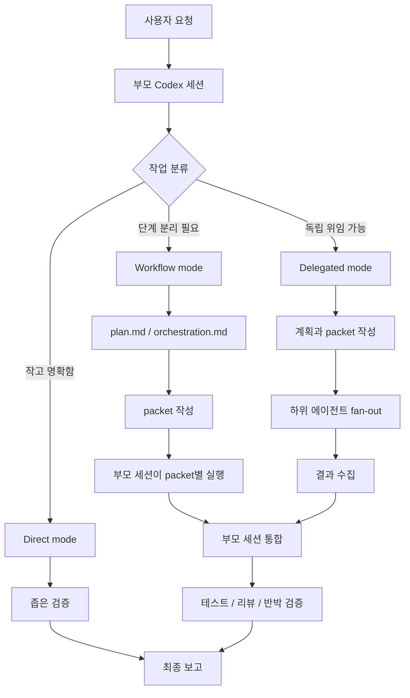

구성 요소는 다음처럼 나뉩니다.

- **부모 세션:** 작업 분류, 계획, 통합, 최종 판단을 담당합니다.
- **packet:** 조사, 구현, 검증처럼 독립적으로 수행할 수 있는 작은 작업 단위입니다.
- **하위 에이전트:** packet을 받아 독립적으로 조사하거나 검증합니다. 쓸 수 없으면 부모 세션이 단계별로 대체 실행합니다.
- **artifact:** `plan.md`, `orchestration.md`, `state.json`, packet/result 파일처럼 실행 과정을 남기는 기록입니다. Codex에서는 기본적으로 `${CODEX_HOME:-$HOME/.codex}/log/ultracode/` 아래에 남기고, 추후 개선 분석을 위해 `metrics.json`과 `summary.jsonl`도 함께 기록합니다.
- **반박 검증:** 나온 결론이 틀렸다고 가정하고 다시 확인하는 단계입니다.

Codex에서 native subagent가 가능하면 `Delegated mode`가 가장 완전한 형태입니다.
그 기능이 없거나 막혀 있으면 `Workflow mode`로 같은 절차를 단일 세션 안에서
재현합니다. 아주 작은 작업은 `Direct mode`로 바로 처리합니다.

## 저장소 구성

```text
./
  .agents/
    plugins/
      marketplace.json
  .codex-plugin/
    plugin.json
  CHANGELOG.md
  README.md
  scripts/
    ultracode-doctor-logs.mjs
  skills/
    ultracode/
      SKILL.md
      agents/
        openai.yaml
      references/
        approval-gates.md
        eval-contracts.md
        execution-examples.md
        forward-testing.md
        js-runner.md
        packet-schema.md
```

| 경로 | 역할 |
| --- | --- |
| `.agents/plugins/marketplace.json` | 이 저장소를 Codex marketplace로 등록하기 위한 manifest입니다. |
| `.codex-plugin/plugin.json` | Codex 플러그인 manifest입니다. |
| `CHANGELOG.md` | 사용자에게 보이는 변경 이력을 기록합니다. |
| `README.md` | 처음 읽는 공개용 소개 문서입니다. |
| `scripts/ultracode-doctor-logs.mjs` | Ultracode 로그와 finalization telemetry를 검사하는 repo/plugin bundle용 보조 도구입니다. |
| `skills/ultracode/SKILL.md` | 실제 스킬 규칙입니다. Codex가 따르는 기준 문서입니다. |
| `skills/ultracode/agents/openai.yaml` | Codex 표시 이름, 기본 프롬프트, 명시 호출 정책을 담습니다. |
| `skills/ultracode/references/` | packet 형식, 승인 gate, 실행 예시, 검증 계약 등 상세 규칙을 담습니다. |

`skills/ultracode/references/js-runner.md`는 예전 파일명을 유지하지만 실제
JavaScript runner가 아닙니다. Codex에서 사용할 수 있는 native subagent와
운영 표면을 Claude Workflow 개념에 대응시키는 adapter 문서입니다.

## 로그 점검

`0.2.1`부터 저장소에는 Ultracode run artifact를 점검하는 보조 명령이 포함됩니다.
이 도구는 `${CODEX_HOME:-$HOME/.codex}/log/ultracode` 아래의 Ultracode-owned
로그만 읽고, Codex의 private session log, `history.jsonl`, `session_index.jsonl`,
SQLite database는 읽지 않습니다.

```bash
node scripts/ultracode-doctor-logs.mjs --plugin-version 1.0.0 --json
```

다른 프로젝트에서 설치된 플러그인의 cache를 직접 점검할 때는 플러그인 root를
먼저 잡고 절대 경로로 실행합니다.

```bash
PLUGIN_ROOT="${CODEX_HOME:-$HOME/.codex}/plugins/cache/codex-ultracode/codex-ultracode/1.0.0"
node "$PLUGIN_ROOT/scripts/ultracode-doctor-logs.mjs" --plugin-version 1.0.0 --json
```

완료 직전 gate로 쓸 때는 한 run만 지정하고 warning까지 실패로 처리합니다.

```bash
node "$PLUGIN_ROOT/scripts/ultracode-doctor-logs.mjs" --run-root "$RUN_ROOT" --fail-on warning
```

완료된 run만 모아서 release gate로 볼 때는 `--terminal-only`를 함께 사용합니다.
진행 중인 artifact가 섞여 있어도 완료 run만 검사하므로 결과 해석이 명확합니다.

```bash
node scripts/ultracode-doctor-logs.mjs --plugin-version 1.0.0 --terminal-only --fail-on warning --json
```

과거 로그에는 `metrics.plugin.version`이 없는 legacy artifact가 있을 수 있습니다.
기본값은 strict error지만, historical audit에서 의도적으로 warning으로 낮추려면
명시 옵션을 사용합니다.

```bash
node scripts/ultracode-doctor-logs.mjs \
  --workspace-key users-jimmy-documents-github-codex-ultracode \
  --terminal-only \
  --legacy-missing-version warning \
  --fail-on error \
  --json
```

workspace key의 대소문자나 `_`/공백 차이 때문에 같은 workspace 로그가 나뉜
경우에는 opt-in 정규화 매칭을 사용할 수 있습니다.

```bash
node scripts/ultracode-doctor-logs.mjs \
  --workspace-key users-jimmy-documents-github-codex-ultracode \
  --workspace-key-normalized \
  --terminal-only \
  --json
```

주요 검사 항목은 다음과 같습니다.

- `state.json`과 `metrics.json`이 parse 가능한지
- 필수 artifact가 있는지
- `metrics.json` 필수 필드와 status enum이 맞는지
- 완료된 run에 matching `summary.jsonl` record가 있는지
- `summary_append_ok=true`가 실제 summary record 재검증 뒤에만 쓰였는지
- `0.2.1` 이상 run의 summary plugin metadata가 `metrics.json`과 맞는지
- 완료된 `0.2.1` 이상 run이 `summary_append_ok=true`로 닫혔는지
- timeout attempt와 최종 reviewer/parent review 성공이 분리되어 기록됐는지

JSON 출력에는 `terminal_metrics_checked`, `nonterminal_metrics_skipped`,
`warnings_by_code`, `errors_by_code`가 포함되어 release gate에서 어떤 종류의 문제가
얼마나 잡혔는지 바로 볼 수 있습니다.

또한 doctor는 `metrics.plugin.version`을 기준으로 필수 필드 목록을 조정합니다.
예를 들어 `0.2.1`에서 추가된 reviewer timeout 필드는 `0.2.0` 로그에는 강제하지
않습니다.

## 설치 방법

이 저장소는 Codex 플러그인 구조를 따릅니다. 플러그인으로 설치하면
`skills/ultracode`가 Codex skill로 로드됩니다.

일반 사용자는 GitHub 저장소를 Codex marketplace로 등록한 뒤 플러그인을
설치합니다.

```bash
codex plugin marketplace add Jimmy-Jung/codex-ultracode --ref main
codex plugin add codex-ultracode@codex-ultracode --json
```

설치 상태는 다음 명령으로 확인합니다.

```bash
codex plugin list --json
```

플러그인 설치 대신 프로젝트 하나에서만 쓰려면 대상 프로젝트의 `.agents/skills/`
아래로 스킬 폴더만 복사합니다.

```bash
mkdir -p your-project/.agents/skills
cp -R skills/ultracode your-project/.agents/skills/ultracode
```

여러 프로젝트에서 개인 스킬처럼 쓰려면 사용자 스킬 폴더로 복사합니다.

```bash
mkdir -p ~/.agents/skills
cp -R skills/ultracode ~/.agents/skills/ultracode
```

설치 후 새 Codex 세션을 열고 명시적으로 호출합니다.

```text
$ultracode로 간헐적으로 실패하는 로그인 버그를 디버깅해줘.
```

`skills/ultracode/agents/openai.yaml`은 `allow_implicit_invocation: false`를 사용합니다.
즉, 평소 작업에 자동으로 끼어들지 않고 사용자가 `$ultracode`, `ultracode`,
`ultra code`처럼 명시적으로 부를 때 사용하는 방식이 기본입니다.

## 어떤 작업에 잘 맞나

Ultracode는 "AI에게 많이 시키는 방법"이 아니라 "복잡한 일을 놓치지 않게
쪼개는 방법"에 가깝습니다.

| 상황 | Ultracode가 하는 일 | 기대 결과 |
| --- | --- | --- |
| 복잡한 디버깅 | 원인 후보를 나누고, 재현 경로와 반박 검증을 분리합니다. | 원인, 수정 범위, 회귀 검증이 함께 남습니다. |
| 스펙 문서 기반 구현 | 스펙을 체크리스트로 나누고, 코드와 테스트에 대응시킵니다. | 구현 누락과 스펙 불일치를 줄입니다. |
| 위험한 모듈 변경 | 조사, 구현, 보안/회귀 검증을 분리합니다. | 변경 이유와 검증 근거가 명확해집니다. |
| 풀 리퀘스트 전 검증 | 변경 파일을 기준으로 독립 리뷰를 수행합니다. | 차단 이슈와 남은 위험을 먼저 확인합니다. |
| 레거시 코드 수정 | 기존 흐름을 먼저 추적하고, 영향 범위를 나눈 뒤 구현합니다. | 수정 전제와 영향 범위가 명확해집니다. |

## 사용 방법

가장 좋은 요청은 목표, 범위, 모드, 제약, 검증 방법을 함께 적는 것입니다.

```text
$ultracode로 <목표>를 수행해줘.
범위: <파일, 모듈, 저장소 범위>.
모드: <읽기 전용 검증 | 계획 먼저 | 조사 후 구현 | 검증만>.
제약: <수정 금지, 커밋 금지, 넓은 변경 전 확인 등>.
필수 검증: <테스트, 빌드, 린트, 문서 일치 검증 등>.
출력: <원하는 결과 형식>.
```

요청이 불명확하면 Ultracode는 바로 넓게 수정하지 않습니다.

```text
$ultracode로 이거 개선해줘.
```

이런 입력에서는 대상이 무엇인지 한 번만 짧게 묻거나, 아래처럼 더 안전한
프롬프트 형태로 다시 제안합니다. 대상은 보이지만 범위가 넓으면 먼저
read-only discovery로 근거를 모읍니다.

```text
$ultracode로 <대상>을 개선해줘.
범위: <파일 또는 모듈>.
모드: 먼저 읽기 전용으로 조사하고, 수정 전 계획을 제시.
제약: 넓은 rewrite, 삭제, 커밋, 푸시는 먼저 확인.
필수 검증: <테스트, 빌드, 리뷰>.
출력: 변경 계획, 근거, 검증 방법.
```

### 풀 리퀘스트 전 위험 변경 검증

```text
$ultracode로 결제 모듈 변경 사항을 풀 리퀘스트 전에 검증해줘.
범위: 변경된 파일, 결제 관련 테스트, 결제 API 경계.
모드: 검증만.
제약: 파일을 수정하지 말고 커밋하지 말 것.
필수 검증: 누락된 예외 케이스, 보안 위험, 회귀 가능성, 테스트 근거.
출력: 차단 이슈, 수정 권장 사항, 남은 위험.
```

### 복잡한 디버깅

```text
$ultracode로 간헐적으로 실패하는 로그인 버그를 디버깅해줘.
범위: 인증 모듈, 세션 처리, 로그인 관련 테스트.
모드: 조사 후 구현.
제약: 원인 가설을 먼저 정리하고, 대규모 수정 전에는 확인할 것.
필수 검증: 재현 경로, 로그나 테스트 근거, 수정 후 회귀 테스트.
출력: 원인, 수정 범위, 변경 내용, 검증 결과, 남은 위험.
```

### 스펙 문서 기반 긴 구현

```text
$ultracode로 specs/payment-v2-spec.md 기준으로 결제 v2를 구현해줘.
범위: 결제 도메인, API, 테스트, 관련 문서.
모드: 조사 후 구현.
제약: 스펙과 다른 기존 동작은 먼저 보고하고, 커밋하거나 푸시하지 말 것.
필수 검증: 스펙 항목별 구현 여부, 단위 테스트, 통합 테스트, 보안 리뷰.
출력: 스펙 체크리스트, 변경된 파일, 검증 결과, 미해결 항목.
```

### 구현 전 구조 파악

```text
$ultracode로 현재 인증 흐름이 어떻게 동작하는지 파악해줘.
범위: 인증 모듈과 관련 미들웨어.
모드: 계획 먼저.
제약: 아직 파일은 수정하지 말 것.
필수 검증: 라우트에서 저장소 계층까지 요청 흐름을 추적할 것.
출력: 위험 요소가 포함된 구현 계획.
```

### 구현과 검증

```text
$ultracode로 먼저 구조를 파악한 뒤 요청한 기능을 구현해줘.
범위: 체크아웃 흐름.
모드: 조사 후 구현.
제약: 대규모 재작성 전에는 먼저 확인하고, 커밋하거나 푸시하지 말 것.
필수 검증: 단위 테스트, 통합 테스트, 보안 리뷰.
출력: 요약, 변경된 파일, 검증 결과.
```

### 변경 후 독립 검증

```text
$ultracode로 풀 리퀘스트 전에 현재 변경 사항을 검증해줘.
범위: 변경된 파일.
모드: 검증만.
제약: 치명적이고 명확한 문제가 아니라면 파일을 수정하지 말 것.
필수 검증: 테스트, 문서 일치 여부, 반박 관점 리뷰.
출력: 차단 이슈를 먼저 쓰고, 그다음 남은 위험을 정리.
```

## 실행 모드

Ultracode는 작업 크기와 환경에 따라 세 가지 방식으로 동작합니다.

| 모드 | 언제 쓰는가 | 동작 |
| --- | --- | --- |
| Direct mode | 작고 명확한 작업 | 부모 세션이 바로 처리하고 좁게 검증합니다. |
| Workflow mode | 하위 에이전트가 없지만 단계 분리가 필요한 작업 | 부모 세션이 계획, 실행, 검증 단계를 나눠 진행합니다. |
| Delegated mode | 하위 에이전트를 쓸 수 있는 복잡한 작업 | 조사, 구현, 검증 packet을 하위 에이전트에 나누고 부모 세션이 통합합니다. |

Codex에서 native delegation이 가능하면 비중 있는 작업은 Delegated mode가 기본입니다.
가능하지 않으면 단일 세션 workflow로 대체하고, 왜 위임하지 않았는지 최종 보고에 남깁니다.

## Codex에서 사용하는 선택적 표면

Ultracode는 별도 runtime이 아니라 Codex의 현재 기능을 조합하는 방식입니다.
아래 표면은 사용할 수 있을 때만 쓰며, 사용할 수 없으면 skip reason을 남기고
가장 가까운 안전한 대안으로 진행합니다.

- `/permissions`: read-only discovery와 bounded implementation을 분리합니다.
- `/diff`: 변경 내용을 최종 통합 전에 확인합니다.
- `/review` 또는 reviewer subagent: 독립적인 반박 검증을 수행합니다.
- `/status`: 권한, 변경 상태, 진행 상태를 확인합니다.
- `/mcp`: 문서, 브라우저, GitHub 같은 외부 tool availability를 확인합니다.
- `codex exec`: 사용자가 명시한 CI dry-run이나 비대화형 report에만 사용합니다.

## 안전 원칙

Ultracode는 강한 작업 모드이기 때문에 부작용을 보수적으로 다룹니다.

- 명시 호출 없이 자동 실행하지 않습니다.
- 커밋, 푸시, 배포, 게시, 외부 리소스 변경은 사용자가 명시적으로 요청해야 합니다.
- 삭제, 대규모 재작성, 인증 정보 변경, 운영 데이터 접근은 먼저 확인합니다.
- 하위 에이전트 결과를 그대로 믿지 않고 부모 세션이 증거와 테스트로 검증합니다.
- 검증하지 못한 항목은 최종 보고에 그대로 밝힙니다.

## 언제 쓰지 말아야 하나

다음 작업에는 Ultracode가 과합니다.

- 오타 하나 수정
- 단일 파일의 작은 문구 변경
- 이미 범위와 원인이 확실한 한 줄 수정
- 단순 명령 실행
- 빠른 대화형 질문

이런 경우에는 일반 Codex 흐름으로 직접 처리하는 편이 더 빠르고 명확합니다.

## 더 자세히 읽기

처음 읽는 순서는 다음을 추천합니다.

1. `README.md`
2. `CHANGELOG.md`
3. `.codex-plugin/plugin.json`
4. `skills/ultracode/SKILL.md`
5. `skills/ultracode/references/execution-examples.md`
6. `skills/ultracode/references/js-runner.md`
7. `skills/ultracode/references/packet-schema.md`
8. `skills/ultracode/references/approval-gates.md`
9. `skills/ultracode/references/eval-contracts.md`
10. `skills/ultracode/references/forward-testing.md`

README는 입문용입니다. 실제 에이전트가 따라야 하는 운영 규칙은
`skills/ultracode/SKILL.md`가 기준입니다.

Workflow artifact는 판단 근거와 실행 기록입니다. repo 정책의 canonical source는
`skills/ultracode/SKILL.md`와 명시적으로 관리되는 reference 문서에 둡니다.

## 라이선스

MIT License를 따릅니다. 자세한 내용은 `LICENSE`를 확인하세요.

---

# English

Ultracode is a Codex skillset for handling complex development work with a
safer multi-agent workflow.

Instead of pushing one large task through in a single pass, the parent Codex
session clarifies the goal, splits the work into smaller packets, delegates to
subagents when available, verifies the results, and integrates the final answer.

This repository adapts the workflow ideas behind Ultracode for Codex's
skill/subagent environment. It is not an official port of Claude Code Workflow,
and it does not reimplement the Claude Code Workflow runtime.

```text
request
-> classify the task
-> plan
-> split into discovery / implementation / verification
-> delegate to subagents when useful
-> parent session integrates evidence and tests
-> final report
```

## What This Skillset Is

Ultracode is not a binary or a separate runtime.

- It is a `SKILL.md`-based skillset that Codex can read.
- It is an operating procedure for planning, decomposition, delegation, and verification.
- It combines Codex-native agents, slash-command surfaces, MCP tools, review, and sandbox policy.
- It is intended to be used only when explicitly invoked with `$ultracode` or similar wording.

Ultracode also has clear boundaries.

- It is not an official OpenAI, Claude, or Google feature.
- It does not implement the Claude Code Workflow runtime.
- It does not provide a JavaScript or Python workflow runner.
- It does not bundle MCP servers, browser automation servers, or deployment tools.

## Why Use It

Small changes are better handled directly.

For example, a typo fix, a one-file summary, or a single command does not need
Ultracode.

Ultracode is useful when missing something would be expensive:

- implementing a feature that requires understanding the whole repository
- debugging a flaky issue with several possible causes
- implementing a long specification
- changing authentication, payments, data migration, or other high-risk surfaces
- changing code, tests, and documentation together
- independently verifying a pull request before merge
- checking a conclusion from an adversarial point of view

The core value is confidence, not speed. One session does not simply decide on
its own; it splits the work, gathers independent evidence, and then the parent
session owns the final integration.

## Why Use Ultracode

> **One-line summary.** On ordinary coding tasks it scores the same as plain codex (we acknowledge this
> honestly). But on tasks where you must scan the whole codebase and *miss nothing*, it finds more. We
> measured that difference with this repository's own benchmarks.

### What Ultracode Does (by analogy)

For hard problems, ultracode uses two approaches:

- **Let one worker think longer** — Codex's `xhigh` reasoning mode (the `model_reasoning_effort` setting). Codex defaults to medium and recommends xhigh for hard, latency-tolerant tasks.
- **Split the work across several workers and combine** — the task is divided among subagents that each study their part in depth, then merge results. Subagents are a native Codex feature (built-in `default`/`worker`/`explorer` agents). This split-and-merge approach is what Claude calls the dynamic workflow (multi-agent) approach.

Both share one principle: **the more an AI thinks (the more "tokens" it spends), the better the result.**
(Research shows ~80% of the performance difference is explained by how many tokens were spent.)

> **⚠️ Source attribution.** The `xhigh` reasoning mode and subagents are **native Codex features** (see the Codex docs below). Organizing them into a *skill-driven workflow* follows **Claude Code Workflow**, and figures like "+90.2%" are **Anthropic's multi-agent research results** — not numbers codex-ultracode re-measured on Codex. Only "What This Repo Measured Directly" below is our own benchmark result.

<details>
<summary>🔬 For AI engineers — technical deep dive</summary>

The two engines are two axes of **test-time compute**. Engine 1 (`xhigh`) increases one policy's *sequential* reasoning depth (reasoning-token budget); Engine 2 (subagents) increases *parallel* sample count and effective context. Anthropic's "~80% of variance explained by token usage" is a slice of the test-time scaling curve — both axes ride the same curve in different directions. But per-axis marginal utility depends sharply on the task's **decomposability** and **verifiability** (measured below); it is not unconditionally monotonic. Cost model: subagents do not share context, so coordination plus per-agent tokens compound to ~15x tokens (Anthropic's figure).

</details>

### What This Repo Measured Directly

Three terms, in plain words first:

- **recall:** of the hidden bugs, how many were actually found. Higher = "missed less".
- **false positive (false alarm):** reporting something as a problem when it actually is not. Lower = better.
- **held-out answer:** the answer used only for grading and never shown to the AI — e.g. the *exact* error
  string a grading test requires.

#### 1. Ordinary code fixes -> identical score (acknowledged)

On the industry-standard SWE-bench Pro (12 problems, real grader), ultracode on or off gave the same result:
the same 3 of 12 solved, down to the same failing problems.

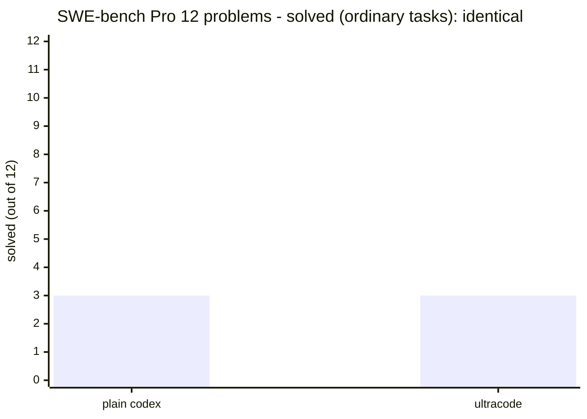

| Method | Solved |
| --- | --- |
| plain codex | 3 / 12 |
| ultracode | 3 / 12 (identical, same problems) |

Evidence: [`bench/REPORT.md` cycles 3b & 4](bench/REPORT.md) · raw data
[`bench/results_pro12.json`](bench/results_pro12.json), [`bench/results_orch12.json`](bench/results_orch12.json)

**Why no difference?** These problems fail because of a *held-out answer* — like the exact error string a
grading test wants — that is never given to the AI. **You cannot recover information that was not provided,
no matter how many AIs you add.** So on ordinary single fixes, **ultracode only spends more tokens for the
same score.** We acknowledge this plainly.

<details>
<summary>🔬 For AI engineers — technical deep dive</summary>

This tie is an **information ceiling, not an orchestration failure**. SWE-bench Pro's decision signal (e.g. FAIL_TO_PASS `assert.EqualError`) is a held-out spec absent from the agent's observable inputs, so the task is underdetermined from inputs alone. Fan-out / adversarial verify / best-of-N reduce epistemic uncertainty (searchable), but these failures are irreducible aleatoric spec ambiguity. best-of-N also needs a **valid in-distribution oracle** (e.g. rich PASS_TO_PASS) to select on — and Pro instances often lack one (flipt `pass_to_pass=[]`). Confirmed against flipt's gold patch: the agent emitted a semantically-equivalent but lexically different error string, so byte-exact matching failed.

</details>

#### 2. Finding every defect across the codebase -> it wins here (proven by benchmark)

Conversely, on "miss-one-and-you-fail" tasks, ultracode finds more. Across 3 codebases with deliberately
planted bugs (46 total), we compared **one worker scanning in a single pass** vs **several AIs splitting,
scanning, and merging**.

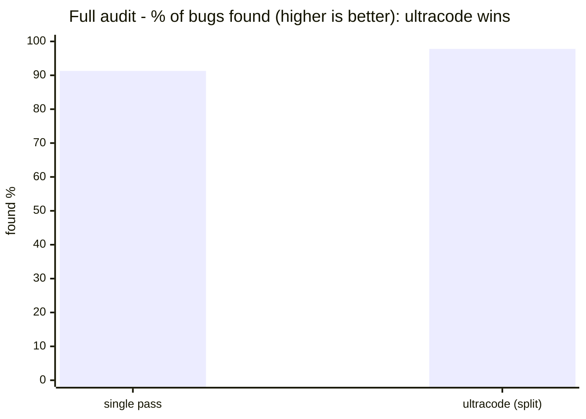

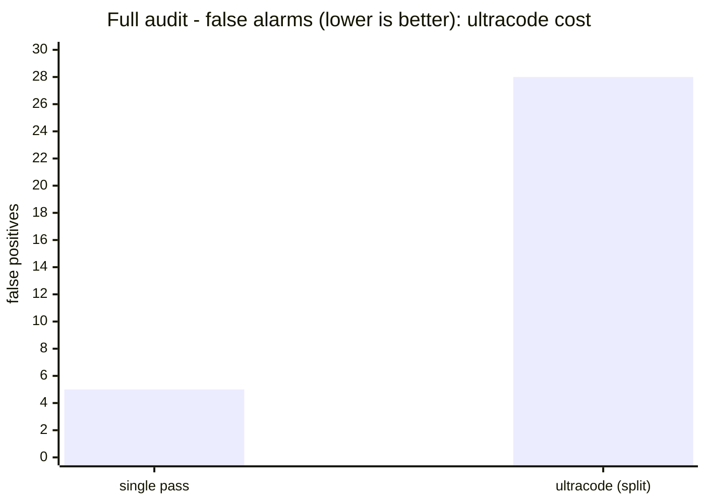

| Metric | single pass | ultracode (split) | Meaning |
| --- | --- | --- | --- |
| recall (found) | 42 of 46 (91.3%) | 45 of 46 (97.8%) | ultracode **misses fewer bugs** |
| false positives | 5 | 28 | ultracode **has more false alarms** |

Evidence: [`bench/REPORT.md` cycle 5](bench/REPORT.md)

**In plain terms:** one worker scanning alone tends to stop at "good enough" and miss subtle bugs. Splitting
the work across several AIs catches those, raising **the share of bugs found from 91.3% to 97.8%** (better in
all 3 codebases). The cost: **false alarms rose from 5 to 28.** So ultracode's benefit is "missing nothing,"
and its cost is "more false alarms to triage." This benefit shows up *only when bugs are subtle*; obvious
bugs like SQL injection are caught even in a single pass.

> **This matches Codex's own docs.** Codex's official subagents documentation says subagents suit "complex tasks that are highly parallel, such as codebase exploration" and "auditing numerous similar items," and that "subagent workflows consume more tokens than comparable single-agent runs" — exactly our two benchmark results (better at finding bugs in a full audit, at a higher token/false-alarm cost).

<details>
<summary>🔬 For AI engineers — technical deep dive</summary>

This is a detection-task **recall–precision tradeoff**. Fan-out preserves per-chunk attention, mitigating single-pass satisficing and attention decay to raise recall — but the completeness critic also raises the false-discovery rate (F1 actually favors solo at these sizes). The optimal operating point is set by **cost asymmetry**: when miss-cost >> triage-cost (security/compliance audits) the high-recall setting is justified; otherwise solo wins. Hence the SKILL routes breadth fan-out output through a **generator/verifier split** (an adversarial-verify gate defaulting to "not a real issue") before reporting, clawing back part of the precision tax.

</details>

<details>
<summary>📋 Benchmark details — config, solved instances, reproduction</summary>

**Configuration**

- **Cycles 1–4 (SWE-bench Pro A/B):** base = `codex` CLI **0.133.0**. Model and reasoning effort were **not pinned** by the harness → codex defaults (medium per the docs). Generation timeout 420–600s, `approval_policy="never"`, `workspace-write`. Grading = official Scale harness `swe_bench_pro_eval.py` on Modal (`jefzda` images); resolved = all of FAIL_TO_PASS ∪ PASS_TO_PASS pass.
- **Cycles 5–6 (audit recall):** both arms = **Claude Opus 4.8** (session model), effort = **xhigh** (session `/effort ultracode`; workflow subagents inherit the main-loop model/effort). A separate agent grades blind.
- Dataset: `ScaleAI/SWE-bench_Pro` (test split), strided n=12. Audit fixtures: `bench/recall/fixtures/`.

**SWE-bench Pro 12 problems — what was solved** (solo and orch are identical per instance)

| Instance | repo | lang | solo | orch |
| --- | --- | --- | :-: | :-: |
| NodeBB-04998908 | NodeBB/NodeBB | js | ✅ | ✅ |
| openlibrary-92db3454 | internetarchive/openlibrary | python | ✅ | ✅ |
| qutebrowser-34a13afd | qutebrowser/qutebrowser | python | ✅ | ✅ |
| flipt-c6a7b1fd | flipt-io/flipt | go | ❌ | ❌ |
| navidrome-8d56ec89 | navidrome/navidrome | go | ❌ | ❌ |
| openlibrary-7f6b722a | internetarchive/openlibrary | python | ❌ | ❌ |
| openlibrary-910b0857 | internetarchive/openlibrary | python | ❌ | ❌ |
| webclients-0200ce0f | protonmail/webclients | ts | ❌ | ❌ |
| webclients-e9677f6c | protonmail/webclients | ts | ❌ | ❌ |
| tutanota-db90ac26 | tutao/tutanota | ts | ❌ | ❌ |
| ansible-5e88cd99 | ansible/ansible | python | ⬜ empty patch | n/a |
| ansible-7e1a3476 | ansible/ansible | python | ⬜ empty patch | n/a |

Solved **3/12** (NodeBB, openlibrary-92db3454, qutebrowser-34a13). solo and orch identical. The two ansible instances are too large; both arms produced empty patches within the timeout cap → symmetrically excluded.

**Audit recall — per fixture** (cycle 5, same model/effort in both arms)

| Fixture (domain) | planted bugs | solo recall | orch recall | solo FP | orch FP |
| --- | :-: | :-: | :-: | :-: | :-: |
| utils (general) | 18 | 15/18 | 17/18 | 5 | 16 |
| http (web) | 14 | 14/14 | 14/14 | 0 | 8 |
| collections | 14 | 13/14 | 14/14 | 0 | 4 |
| **total** | **46** | **42 (91.3%)** | **45 (97.8%)** | **5** | **28** |

Cycle 6 merges the same 46 bugs into one 24-file codebase at 188 lines (solo 43/46, orch 44/46) — negligible gain. Cycle 7 grows those 24 files to 13,460 lines: **solo 32/46 (69.6%) vs fan-out 44/46 (95.7%) — +12 bugs** (the advantage grows with volume). **effort x arm matrix (SWE-bench Pro, 10 instances, ansible excluded)**

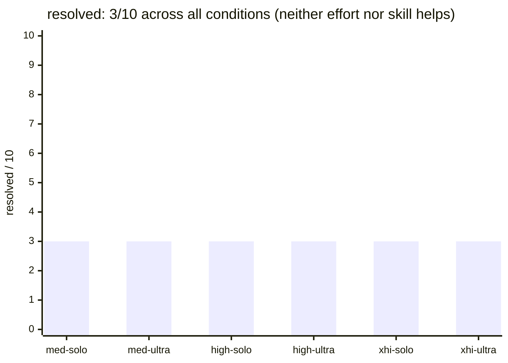

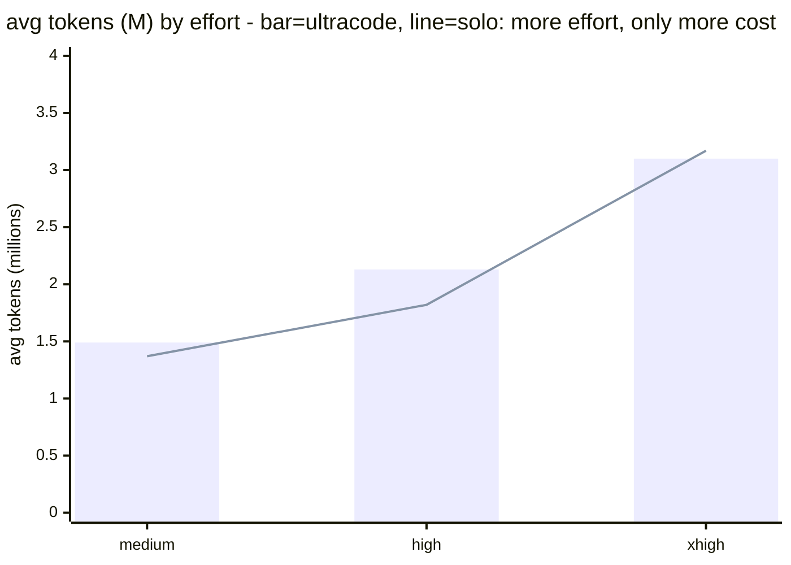

| effort | arm | resolved | avg tokens (total) |
| --- | --- | :-: | --: |
| medium | solo | 3/10 | 1.37M |
| medium | ultracode | 3/10 | 1.49M |
| high | solo | 3/10 | 1.82M |
| high | ultracode | 3/10 | 2.13M |
| xhigh | solo | 3/10 | 3.17M |
| xhigh | ultracode | 3/10 | 3.10M |

All 6 conditions resolve **3/10, the same instances**. Raising effort medium->xhigh costs ~2.3x tokens with zero accuracy change, and ultracode ties solo at every effort (only 1.08-1.16x more tokens, paired). Pro failures are held-out-information problems: neither more reasoning (higher effort) nor the skill can solve them — both only spend more tokens.

Reproduction: Reproduction: [`bench/recall/README.md`](bench/recall/README.md).

</details>

### Summary — When It Is Worth It

| Task type | Our benchmark result | Verdict |
| --- | --- | --- |
| Ordinary single fix | identical score | **Not worth it (only more tokens)** |
| Miss-nothing full audit / review | finds more (+6.5 points) | **Worth it (but accept more false alarms)** |
| Many files (24 files, 188 lines, measured) | advantage shrinks to noise (+1 bug); false-alarm cost persists | **More files alone does not grow the advantage** (cycle 6) |
| Large volume (24 files, 13,460 lines, ~107K tokens, measured) | solo recall 91–93% **collapses to 69.6%**; fan-out holds at 95.7% | **The advantage explodes with volume** (+12 bugs, cycle 7) |
| True window overflow (>200K tokens) | not measured — trend predicts an even wider gap | unverified |

Full numbers and methodology are in [`bench/REPORT.md`](bench/REPORT.md). In one sentence: **the advantage
codex-ultracode proved with benchmarks is "missing fewer bugs in a full audit"; on ordinary tasks the score
is the same.**

<details>
<summary>🔬 For AI engineers — technical deep dive</summary>

The operating rule is essentially a **compute-allocation policy**: fan out only when expected marginal recall × miss-cost > added tokens + FP-triage cost. Codex's subagents doc corroborates the cost side ("more tokens than a comparable single-agent run") as a primary source. Threats to validity: single trial per condition (LLM nondeterminism), synthetic codebases, and — critically — total size fits the context window, so the true "exceeds-context" regime is untested; its marginal utility rests only on the borrowed principle (Claude) and remains ours to measure.

</details>

Sources:

**Codex official docs**
- Config reference (`model_reasoning_effort`): <https://developers.openai.com/codex/config-reference>
- CLI: <https://developers.openai.com/codex/cli>
- Subagents: <https://developers.openai.com/codex/subagents>
- Best practices: <https://developers.openai.com/codex/learn/best-practices>

**Borrowed principle (Claude / Anthropic)**
- Claude effort docs: <https://platform.claude.com/docs/en/build-with-claude/effort>
- Anthropic multi-agent research: <https://www.anthropic.com/engineering/multi-agent-research-system>

## How It Works

The parent Codex session remains responsible for the work. Subagents are used
only for bounded, useful packets.

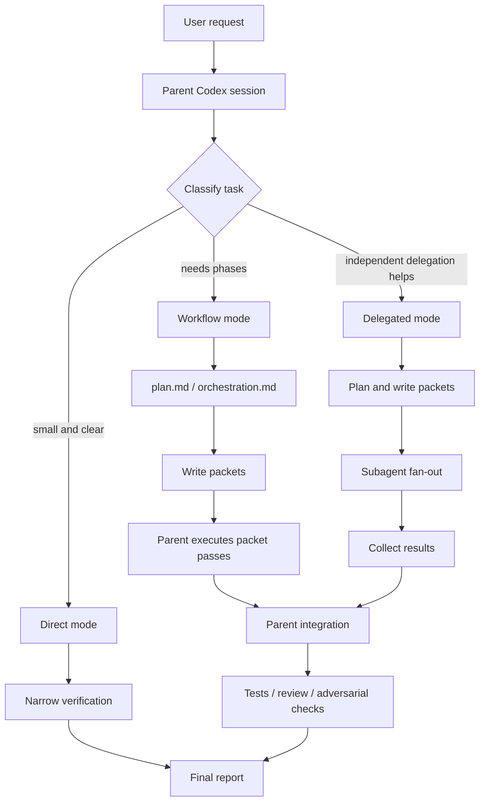

Main concepts:

- **Parent session:** classifies the task, plans, integrates results, and makes the final call.
- **Packet:** a small unit of discovery, implementation, or verification work.
- **Subagent:** an independent agent assigned to one packet. If subagents are unavailable, the parent session performs the same phases directly.
- **Artifact:** files such as `plan.md`, `orchestration.md`, `state.json`, packet/result notes, `metrics.json`, and `summary.jsonl`.
- **Adversarial verification:** a check that tries to prove the current conclusion wrong before the final answer is trusted.

When Codex-native subagents are available, substantial tasks use Delegated mode.
When they are unavailable, Ultracode falls back to a single-session workflow.
Tiny tasks should use Direct mode.

## Repository Layout

```text
./
  .agents/
    plugins/
      marketplace.json
  .codex-plugin/
    plugin.json
  CHANGELOG.md
  README.md
  scripts/
    ultracode-doctor-logs.mjs
  skills/
    ultracode/
      SKILL.md
      agents/
        openai.yaml
      references/
        approval-gates.md
        eval-contracts.md
        execution-examples.md
        forward-testing.md
        js-runner.md
        packet-schema.md
```

| Path | Purpose |
| --- | --- |
| `.agents/plugins/marketplace.json` | Marketplace manifest for registering this repository with Codex. |
| `.codex-plugin/plugin.json` | Codex plugin manifest. |
| `CHANGELOG.md` | User-facing release notes. |
| `README.md` | Introductory public documentation. |
| `scripts/ultracode-doctor-logs.mjs` | Helper for checking Ultracode log artifacts and finalization telemetry. |
| `skills/ultracode/SKILL.md` | The canonical skill instructions followed by Codex. |
| `skills/ultracode/agents/openai.yaml` | Display metadata, default prompts, and explicit-invocation policy. |
| `skills/ultracode/references/` | Detailed references for packets, approval gates, execution examples, and eval contracts. |

`skills/ultracode/references/js-runner.md` keeps its historical filename, but it
is not a JavaScript runner. It is an adapter document that maps Claude Workflow
ideas to Codex-native subagent and tool surfaces.

## Log Doctor

Since `0.2.1`, this repository includes a helper that checks Ultracode run
artifacts. It reads only the Ultracode-owned log tree under
`${CODEX_HOME:-$HOME/.codex}/log/ultracode`; it does not read Codex private
session logs, `history.jsonl`, `session_index.jsonl`, or SQLite databases.

```bash
node scripts/ultracode-doctor-logs.mjs --plugin-version 1.0.0 --json
```

To check an installed plugin cache directly:

```bash
PLUGIN_ROOT="${CODEX_HOME:-$HOME/.codex}/plugins/cache/codex-ultracode/codex-ultracode/1.0.0"
node "$PLUGIN_ROOT/scripts/ultracode-doctor-logs.mjs" --plugin-version 1.0.0 --json
```

For a final gate before completing one run, prefer `--run-root` and fail on
warnings:

```bash
node "$PLUGIN_ROOT/scripts/ultracode-doctor-logs.mjs" --run-root "$RUN_ROOT" --fail-on warning
```

To check only terminal runs, use `--terminal-only`.

```bash
node scripts/ultracode-doctor-logs.mjs --plugin-version 1.0.0 --terminal-only --fail-on warning --json
```

Older artifacts may not have `metrics.plugin.version`. The default behavior is
strict, but historical audits can explicitly downgrade that case to a warning.

```bash
node scripts/ultracode-doctor-logs.mjs \
  --workspace-key users-jimmy-documents-github-codex-ultracode \
  --terminal-only \
  --legacy-missing-version warning \
  --fail-on error \
  --json
```

If old workspace keys differ only by case, underscores, or spaces, use opt-in
normalized matching.

```bash
node scripts/ultracode-doctor-logs.mjs \
  --workspace-key users-jimmy-documents-github-codex-ultracode \
  --workspace-key-normalized \
  --terminal-only \
  --json
```

The doctor checks:

- whether `state.json` and `metrics.json` parse
- whether required artifacts exist
- whether `metrics.json` required fields and status enums are valid
- whether terminal runs have matching `summary.jsonl` records
- whether `summary_append_ok=true` reflects an actual summary re-read
- whether `0.2.1+` summary plugin metadata matches `metrics.json`
- whether terminal `0.2.1+` runs finalize with `summary_append_ok=true`
- whether timeout attempts are separated from eventual review success

JSON output includes `terminal_metrics_checked`, `nonterminal_metrics_skipped`,
`warnings_by_code`, and `errors_by_code` so release gates can explain failures
by issue type.

## Installation

This repository follows the Codex plugin layout. Installing it as a plugin makes
`skills/ultracode` available as a Codex skill.

For normal installation, register the GitHub repository as a Codex marketplace,
then install the plugin.

```bash
codex plugin marketplace add Jimmy-Jung/codex-ultracode --ref main
codex plugin add codex-ultracode@codex-ultracode --json
```

Check the installed plugin list with:

```bash
codex plugin list --json
```

For one project, copy the skill folder into `.agents/skills/`.

```bash
mkdir -p your-project/.agents/skills
cp -R skills/ultracode your-project/.agents/skills/ultracode
```

For user-level use across projects:

```bash
mkdir -p ~/.agents/skills
cp -R skills/ultracode ~/.agents/skills/ultracode
```

Then open a fresh Codex session and invoke the skill explicitly.

```text
$ultracode debug this intermittent login failure.
```

`skills/ultracode/agents/openai.yaml` uses `allow_implicit_invocation: false`.
That means Ultracode should not automatically take over ordinary work; it is
designed for explicit invocation.

## Good Use Cases

| Situation | What Ultracode Does | Expected Result |
| --- | --- | --- |
| Complex debugging | Splits causes, reproduction paths, and verification. | Cause, change scope, and regression checks are documented. |
| Spec-driven implementation | Turns the spec into packets and verification checks. | Fewer missed requirements and clearer traceability. |
| Risky module changes | Separates discovery, implementation, and review. | Clear rationale and verification evidence. |
| Pre-PR review | Reviews changed files independently. | Blocking issues and residual risks are found earlier. |
| Legacy code changes | Traces current behavior before editing. | Assumptions and blast radius are explicit. |

## Usage

The best prompt includes goal, scope, mode, constraints, and required checks.

```text
Use $ultracode to <goal>.
Scope: <files, modules, or repository area>.
Mode: <read-only audit | plan first | implement after discovery | verify only>.
Constraints: <no edits, no commits, ask before broad rewrites, etc.>.
Required checks: <tests, build, lint, docs parity, review>.
Output: <desired result format>.
```

If the request is vague, Ultracode should not make broad edits. It should ask
one short clarification question or propose a safer rewritten prompt.

```text
Use $ultracode to improve <target>.
Scope: <file or module>.
Mode: read-only discovery first, then propose a plan before editing.
Constraints: ask before broad rewrites, deletion, commits, or pushes.
Required checks: <tests, build, review>.
Output: plan, evidence, and verification steps.
```

### Pre-PR Review

```text
Use $ultracode to review the payment module changes before a pull request.
Scope: changed files, payment tests, and payment API boundaries.
Mode: verify only.
Constraints: do not edit files or commit.
Required checks: missing edge cases, security risks, regressions, and test evidence.
Output: blocking issues first, then recommendations and remaining risks.
```

### Complex Debugging

```text
Use $ultracode to debug an intermittent login failure.
Scope: auth module, session handling, and login tests.
Mode: investigate, then implement.
Constraints: summarize hypotheses before editing; ask before broad changes.
Required checks: reproduction path, log or test evidence, regression tests.
Output: cause, change scope, changed files, verification, remaining risks.
```

### Spec-Driven Implementation

```text
Use $ultracode to implement payment v2 from specs/payment-v2-spec.md.
Scope: payment domain, API, tests, and related docs.
Mode: investigate, then implement.
Constraints: report behavior that conflicts with the spec; do not commit or push.
Required checks: spec checklist, unit tests, integration tests, security review.
Output: checklist, changed files, verification, unresolved items.
```

## Modes

| Mode | When to Use | Behavior |
| --- | --- | --- |
| Direct mode | Small, clear tasks | Parent session handles the task and runs a narrow check. |
| Workflow mode | Multiple phases, but no subagents | Parent session runs planning, execution, and verification in one session. |
| Delegated mode | Complex work where subagents help | Parent session delegates packets and integrates the results. |

## Codex Surfaces Used

Ultracode is not a separate runtime. It uses Codex surfaces when available and
records skip reasons when they are unavailable.

- `/permissions`: separates read-only discovery from bounded implementation.
- `/diff`: reviews changes before final integration.
- `/review` or reviewer subagent: performs independent adversarial verification.
- `/status`: checks permissions, change state, and run state.
- `/mcp`: checks availability of external tools such as docs, browser, or GitHub tools.
- `codex exec`: only for user-requested CI dry runs or non-interactive reports.

## Safety Principles

- Do not run automatically without explicit invocation.
- Do not commit, push, deploy, publish, or mutate external resources unless the user asks.
- Ask before deletion, broad rewrites, credential changes, or production data access.
- Do not trust subagent results blindly; the parent session verifies evidence and tests.
- Report skipped verification honestly.

## When Not To Use It

Ultracode is too heavy for:

- one typo
- a tiny wording change in one file
- a one-line fix with a known cause
- a simple command
- a quick conversational question

Use the normal Codex flow for those.

## Recommended Reading Order

1. `README.md`
2. `CHANGELOG.md`
3. `.codex-plugin/plugin.json`
4. `skills/ultracode/SKILL.md`
5. `skills/ultracode/references/execution-examples.md`
6. `skills/ultracode/references/js-runner.md`
7. `skills/ultracode/references/packet-schema.md`
8. `skills/ultracode/references/approval-gates.md`
9. `skills/ultracode/references/eval-contracts.md`
10. `skills/ultracode/references/forward-testing.md`

`README.md` is introductory. The canonical operating rules live in
`skills/ultracode/SKILL.md` and the explicitly maintained reference documents.

Workflow artifacts are evidence and execution records, not the canonical policy.

## License

MIT License. See `LICENSE` for details.
