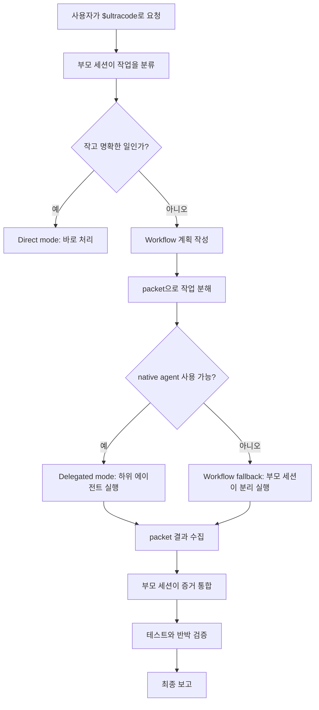
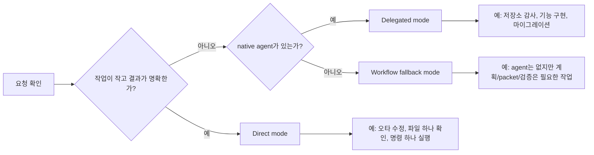
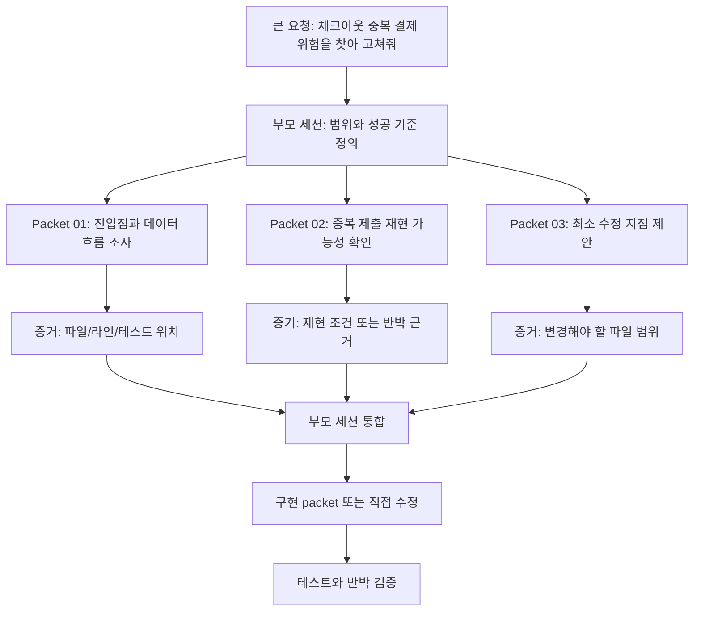
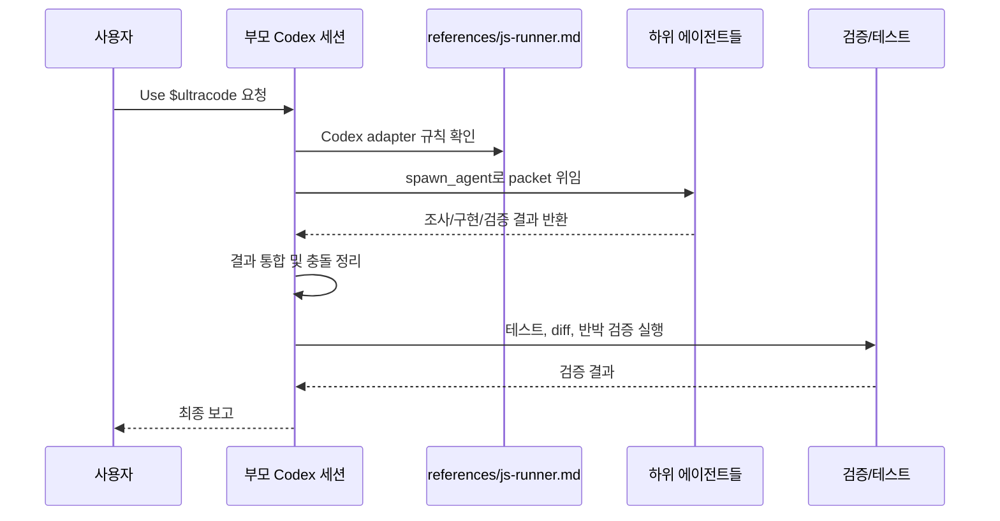

# Ultracode

한국인 개발자를 위한 Codex/Claude 멀티 에이전트 워크플로우 스킬

> Author: JunyoungJung
> Date: 2026-06-18

Ultracode는 복잡한 작업을 한 번에 처리하지 않고, **계획 -> 분해 -> 병렬 조사/구현 -> 반박 검증 -> 통합 -> 최종 보고** 순서로 진행하게 만드는 Codex/Claude용 워크플로우 스킬입니다.

한마디로 말하면, "AI에게 그냥 열심히 해줘"라고 맡기는 대신, 부모 세션이 작업을 작게 나누고 여러 하위 에이전트에게 맡긴 뒤, 다시 모아서 검증하는 방식입니다.

이 README는 한국 개발자가 GitHub에서 처음 이 저장소를 봤을 때 바로 이해할 수 있도록 작성했습니다. 용어는 실무에서 자주 쓰는 표현을 우선하고, 필요한 영어 용어는 괄호로 함께 적었습니다.

## 30초 요약

- **Ultracode는 실행 파일이 아니라 스킬입니다.** Codex/Claude 같은 호스트가 가진 하위 에이전트 기능을 잘 쓰게 만드는 운영 규칙입니다.
- **작은 일은 직접 처리합니다.** 오타 수정, 파일 하나 요약 같은 일은 복잡한 workflow를 만들지 않습니다.
- **큰 일은 나눕니다.** 조사, 설계, 구현, 테스트, 리뷰를 packet이라는 작은 단위로 쪼갭니다.
- **중요한 주장은 반박 검증합니다.** "맞는 것 같다"가 아니라 "틀렸다고 가정하고 다시 확인"합니다.
- **부모 세션이 최종 책임을 집니다.** 하위 에이전트 결과를 그대로 믿지 않고, 증거와 테스트로 통합합니다.

한국 개발자 기준으로는 다음 상황에서 특히 유용합니다.

- PR 올리기 전에 큰 변경을 한 번 더 검증하고 싶을 때
- 레거시 코드 흐름을 먼저 파악한 뒤 기능을 넣어야 할 때
- 테스트는 통과하지만 실제 설계상 위험이 남아 있을 수 있을 때
- 인증, 결제, 데이터 마이그레이션처럼 장애 비용이 큰 작업을 다룰 때
- 여러 파일을 동시에 바꾸면서 문서와 테스트까지 맞춰야 할 때

## 먼저 알아야 할 것

Ultracode는 독립 실행 프로그램이 아닙니다.

- 공식 OpenAI, Claude, Google 기능이 아닙니다.
- 로컬에서 실행하는 JavaScript/Python runner가 아닙니다.
- 혼자서 에이전트를 생성하는 마법 도구가 아닙니다.
- Codex, Claude Code 같은 호스트가 제공하는 실제 하위 에이전트 기능을 더 체계적으로 쓰기 위한 **스킬 문서 묶음**입니다.

그래서 핵심은 단순합니다.

```text
사용자 요청
-> 부모 AI 세션이 작업을 분류
-> 필요한 경우 여러 packet으로 분해
-> 호스트의 native agent 기능으로 하위 에이전트 실행
-> 결과를 부모 세션이 검증하고 통합
-> 테스트, 리뷰, 최종 보고
```

## Claude Code Workflows와의 차이

Claude Code의 Workflows는 Claude Code가 생성한 JavaScript workflow script를 전용 런타임에서 실행하는 공식 기능입니다. `/workflows` UI, 저장된 workflow, `args`, runtime cache, JavaScript `agent()`, `parallel()`, `pipeline()` 같은 실행 표면이 있습니다.

Ultracode는 그 런타임을 구현하지 않습니다. Codex에서는 공식 Codex 기능인 skills, subagents, slash commands, MCP, review, sandbox/approval, non-interactive mode를 조합해 비슷한 운영 절차를 재현합니다.

| 항목 | Claude Code Workflows | Ultracode for Codex |
| --- | --- | --- |
| 정체 | Claude Code 공식 workflow runtime | Codex skill/adaptor |
| 실행 방식 | JavaScript workflow script 실행 | 부모 Codex 세션이 native 기능을 조율 |
| 병렬 작업 | `agent()`, `parallel()`, `pipeline()` | subagent, `/agent`, `spawn_agent` 계열 도구 |
| 상태 관리 | runtime journal/cache | `plan.md`, `state.json`, `packets/`, `results/` |
| 스키마 | runtime 수준 structured output | prompt + 부모 세션 검증 |
| 재사용 | `/workflows`, `.claude/workflows/` | skills 설치, 필요 시 plugin packaging |

Claude Code의 `/deep-research`도 이 저장소에 내장하지 않습니다. Codex에서 비슷한 조사를 하고 싶다면 아래처럼 deep-research-style 요청으로 사용합니다.

```text
Use $ultracode to run a deep-research-style investigation.
Scope: <질문 또는 조사 범위>.
Mode: read-only research.
Constraints: cite sources, do not edit files.
Required checks: cross-check important claims with independent sources.
Output: cited report with uncertain claims separated.
```

## 왜 필요한가

작은 수정은 한 번에 처리해도 됩니다.

예를 들어 README 오타 하나를 고치는 데 여러 에이전트를 부를 필요는 없습니다. 이런 작업은 직접 고치고 diff만 확인하면 충분합니다.

하지만 다음 같은 작업은 한 번에 처리하면 놓치는 것이 생깁니다.

- 저장소 전체 버그 감사
- 결제, 인증, 데이터 마이그레이션처럼 실수 비용이 큰 변경
- 기존 구조를 파악한 뒤 기능을 설계하고 구현해야 하는 작업
- 여러 파일과 테스트, 문서가 동시에 맞아야 하는 작업
- "정말 빠진 게 없는지" 독립 검증이 필요한 작업

Ultracode는 이런 상황에서 부모 세션이 혼자 직감으로 끝내지 않도록, 작업을 명시적으로 쪼개고 검증하게 만듭니다.

## 머릿속 그림

일반적인 AI 작업 흐름은 보통 이렇습니다.

```text
요청 -> AI가 읽음 -> AI가 수정 -> AI가 요약
```

Ultracode의 흐름은 조금 더 깁니다.

```text
요청
-> 이게 작은 일인지, 큰 일인지 판단
-> 큰 일이면 계획서 작성
-> 조사 packet, 구현 packet, 검증 packet으로 분해
-> 독립적으로 할 수 있는 일은 하위 에이전트에게 위임
-> 부모 세션이 결과를 읽고 충돌을 정리
-> 테스트와 반박 검증
-> 최종 보고
```

이 흐름의 장점은 "많이 시킨다"가 아니라, **서로 다른 관점으로 확인하게 만든다**는 점입니다.

## 전체 동작 흐름



## GitHub 공개 구조

```text
./
  README.md
  ultracode/
    SKILL.md
    agents/
      openai.yaml
    references/
      approval-gates.md
      eval-contracts.md
      execution-examples.md
      forward-testing.md
      js-runner.md
      packet-schema.md
```

각 파일의 역할은 다음과 같습니다.

| 파일 | 역할 |
| --- | --- |
| `README.md` | GitHub에서 처음 읽는 공개용 입문 문서입니다. 원리, 설치, 사용 예시를 설명합니다. |
| `ultracode/SKILL.md` | Ultracode의 메인 운영 규칙입니다. 언제 직접 처리하고, 언제 workflow를 만들고, 언제 하위 에이전트를 쓰는지 정의합니다. |
| `ultracode/agents/openai.yaml` | Codex 쪽 표시 이름, 기본 프롬프트, 암시적 실행 정책을 담습니다. |
| `ultracode/references/js-runner.md` | 이름은 js-runner지만 실제 JS runner가 아닙니다. Codex native agent, slash command, artifact 운용 방식을 설명하는 runtime adapter입니다. |
| `ultracode/references/packet-schema.md` | `plan.md`, `orchestration.md`, `state.json`, packet/result 파일의 형식을 정의합니다. |
| `ultracode/references/execution-examples.md` | 어떤 요청에서 direct/workflow/delegated mode를 고르는지 예시를 제공합니다. |
| `ultracode/references/approval-gates.md` | 삭제, 배포, force push 같은 위험한 작업 전에 언제 승인을 받아야 하는지 정의합니다. |
| `ultracode/references/eval-contracts.md` | 여러 packet 결과가 한 표면에 합쳐질 때 drift를 막는 계약 형식을 정의합니다. |
| `ultracode/references/forward-testing.md` | 이 스킬 자체를 테스트하거나 개선할 때 쓰는 검증 프롬프트 모음입니다. |

이 저장소는 Codex skill bundle입니다. MCP server, Codex plugin runtime, Claude Workflow runtime, 브라우저 자동화 서버를 제공하지 않습니다. 나중에 여러 사용자가 설치하기 쉬운 형태가 필요해지면 `ultracode/`를 기반으로 별도 Codex plugin packaging을 추가하는 순서가 맞습니다.

## 설치 방법

GitHub에서는 문서와 스킬 본문을 분리합니다.

- 공개 문서: `README.md`
- 실제 스킬 폴더: `ultracode/`

프로젝트 안에서만 쓰고 싶다면 `ultracode/`를 프로젝트의 `.agents/skills/ultracode/`로 복사합니다.

```text
your-project/
  .agents/
    skills/
      ultracode/
        SKILL.md
        agents/
        references/
```

예시:

```bash
mkdir -p your-project/.agents/skills
cp -R ultracode your-project/.agents/skills/ultracode
```

여러 프로젝트에서 개인 스킬처럼 쓰고 싶다면 `ultracode/`를 사용자 스킬 폴더로 복사합니다.

```text
~/.agents/skills/ultracode/
```

예시:

```bash
mkdir -p ~/.agents/skills
cp -R ultracode ~/.agents/skills/ultracode
```

일부 기존 로컬 환경에서는 `.codex/skills/ultracode/`를 함께 쓰고 있을 수 있습니다. GitHub 공개 문서는 Codex 공식 skill 위치인 `.agents/skills`를 기본으로 설명하고, `.codex/skills`는 기존 환경 호환용 복사본으로만 유지하세요.

설치 후에는 새 Codex 세션을 열고 명시적으로 호출합니다.

```text
Use $ultracode to audit this repository for correctness risks.
```

`agents/openai.yaml`의 정책은 `allow_implicit_invocation: false`입니다. 즉, 평소에는 자동으로 끼어들지 않고 사용자가 `$ultracode`, `ultracode`, `ultra code`처럼 명시적으로 부를 때 사용하는 쪽이 기본입니다.

## 가장 작은 첫 사용 예시

처음 테스트할 때는 저장소 전체를 맡기기보다 작고 안전한 작업으로 확인하는 편이 좋습니다.

```text
Use $ultracode to inspect the current README and suggest three clarity improvements.
Mode: read-only audit.
Constraints: do not edit files.
Required checks: cite exact sections.
Output: findings with evidence.
```

이 요청은 파일을 수정하지 않습니다. Ultracode가 어떻게 작업을 분류하고, 어떤 증거를 요구하는지 보는 데 좋습니다.

## 언제 쓰면 좋은가

Ultracode가 잘 맞는 작업입니다.

- 저장소 전체나 큰 모듈을 감사할 때
- 버그 원인이 여러 위치에 흩어져 있을 때
- 새 기능을 구현하기 전에 기존 구조를 파악해야 할 때
- 구현, 테스트, 문서가 함께 바뀌는 작업일 때
- 보안, 결제, 인증, 데이터 마이그레이션처럼 검증이 중요한 작업일 때
- "독립적인 반박 검증"이 필요한 작업일 때

굳이 쓰지 않아도 되는 작업입니다.

- 오타 하나 수정
- 파일 하나 읽고 요약
- 명령 하나 실행
- 이미 원인이 명확한 작은 수정
- 사용자가 빠른 답변만 원하는 질문

## 세 가지 실행 모드

실행 모드는 작업 크기와 하위 에이전트 사용 가능 여부로 결정합니다.



### 1. Direct mode

아주 작은 작업입니다.

예시:

```text
Use $ultracode to fix one typo in README and verify the diff.
```

기대 동작:

- workflow artifact를 만들지 않습니다.
- 오타를 직접 수정합니다.
- diff를 확인합니다.

### 2. Workflow fallback mode

하위 에이전트 기능이 없거나 막혀 있지만, 작업은 여러 단계가 필요한 경우입니다.

예시:

```text
Use $ultracode to audit this small repo for slow startup paths, but assume this environment cannot spawn subagents.
```

기대 동작:

- 부모 세션이 packet을 만들고 직접 분리된 pass처럼 실행합니다.
- `plan.md`, `orchestration.md`, `state.json`, `results/` 같은 artifact를 만듭니다.
- native agent를 쓰지 못한 이유를 기록합니다.

### 3. Delegated mode

Ultracode의 기본 모드입니다. 작업이 실질적으로 크고, 호스트가 native agent를 제공할 때 사용합니다.

예시:

```text
Use $ultracode to audit this repository for correctness risks.
```

기대 동작:

- 부모 세션이 계획과 packet을 만듭니다.
- 여러 read-only finder가 서로 다른 관점으로 조사합니다.
- 중요한 finding은 verifier가 반박 검증합니다.
- 부모 세션이 증거를 읽고 최종 판단합니다.

## 실행 중 만들어지는 artifact

Ultracode는 기본적으로 workspace 안에 `.workflow/`를 만들지 않습니다.

기본 위치는 OS temp 아래입니다.

```text
${TMPDIR:-/tmp}/ultracode/<workspace-key>/<run-slug>/
```

대표 구조는 다음과 같습니다.

```text
<run-root>/<slug>/
  plan.md
  orchestration.md
  state.json
  packets/
    01-discovery.md
    02-tests.md
  results/
    01-discovery.md
    02-tests.md
  integration.md
  final-report.md
```

사용자가 명시적으로 요청할 때만 workspace 안의 `.workflow/ultracode/` 같은 위치를 씁니다.

## packet이란 무엇인가

packet은 하위 에이전트나 부모 세션이 수행할 수 있는 작은 작업 단위입니다.

좋은 packet은 좁고, 증거 기반이며, 소유 범위가 분명합니다.

실무 감각으로 보면 packet은 "PR 하나"보다 더 작은 작업입니다. 예를 들어 "체크아웃 버그를 고쳐줘"는 너무 큽니다. 대신 "체크아웃 진입점 찾기", "중복 결제 가능성 검증", "버튼 disable 처리 구현", "회귀 테스트 추가"처럼 나눕니다.



좋은 예:

```text
Packet: checkout entry point discovery

Objective:
Find the files that start the checkout flow.

Sources:
- app/routes/
- app/features/checkout/

Do:
- inspect entry points
- cite file paths and line numbers
- identify tests that cover checkout

Do not:
- edit files
- change tests
- inspect unrelated payment provider code unless one nearby hop is needed
```

나쁜 예:

```text
Packet: fix checkout
```

이건 범위가 너무 넓습니다. 어디를 읽고, 어디를 고치고, 무엇을 검증해야 하는지 알 수 없습니다.

## parallel과 pipeline의 차이

Ultracode는 두 가지 fan-out 모양을 구분합니다.

### parallel

모든 에이전트를 먼저 실행하고, 전부 끝난 뒤 다음 단계로 갑니다.

```text
finder A ----\
finder B -----+--> parent waits for all -> merge
finder C ----/
```

다음 단계가 모든 결과를 한 번에 봐야 할 때 적합합니다.

예시:

- 여러 후보 설계를 모은 뒤 한 번에 비교
- 전체 finding을 dedup한 뒤 우선순위 정하기

### pipeline

각 item이 끝나는 즉시 다음 단계로 넘깁니다.

```text
item 1: find -> verify -> summarize
item 2: find -> verify -> summarize
item 3: find -> verify -> summarize
```

전체가 끝날 때까지 기다릴 필요가 없을 때 기본값입니다.

예시:

- finding 하나를 찾자마자 verifier에게 반박 검증시키기
- 파일별 조사 결과를 바로 다음 검토 단계로 넘기기

## 반박 검증이 중요한 이유

AI는 그럴듯한 답을 만들 수 있습니다. Ultracode는 중요한 주장에 대해 "맞다고 가정"하지 않고, 독립 검증자에게 반박을 시킵니다.

예시:

```text
Finding:
The checkout page may submit duplicate payment requests.

Verifier task:
Try to refute this finding.
Check whether the cited code really allows duplicate submission.
Default to refuted when evidence is weak.
```

검증자가 "증거가 약하다"고 판단하면 부모 세션은 그 finding을 최종 보고에서 제외하거나 `uncertain`으로 낮춰야 합니다.

## 승인 gate

Ultracode는 agent 수나 token 사용량 자체를 승인 gate로 보지 않습니다. 대신 실제 side effect가 있는 작업에 gate를 둡니다.

여기서 말하는 승인 gate는 Ultracode의 운영 규칙입니다. Codex의 sandbox/approval policy는 별도의 host-level 안전장치이며, Ultracode가 이를 우회하거나 완화하지 않습니다. 예를 들어 Codex가 read-only 모드라면 Ultracode도 파일을 수정할 수 없습니다.

승인이 필요한 예:

- 파일 삭제
- 대량 rename
- broad codemod
- force push
- publish, deploy, email, post
- credential, billing, production data 수정

승인이 없어도 보통 안전한 예:

- 파일 읽기
- diff 확인
- 로컬 테스트 실행
- read-only 하위 에이전트 실행
- temp run root 아래 draft 작성

## eval contract

eval contract는 여러 packet이 같은 표면을 건드릴 때 "무엇이 성공인지"를 미리 고정하는 장치입니다.

간단한 inline 예:

```text
Eval contract:
- Outcome: settings export produces a downloadable JSON file.
- Shared surfaces: settings storage, export API, UI button.
- Required checks: unit tests, API integration test, UI smoke.
- Blocking conditions: schema mismatch, missing auth check, broken import path.
- Handoff evidence: changed files, local checks, remaining risks.
```

API schema, CLI, 인증, 데이터 마이그레이션처럼 위험한 작업은 `eval-contract.md`를 별도 파일로 만듭니다.

## Codex에서의 동작 방식

Codex에서는 Claude Code Workflow의 `agent`, `parallel`, `pipeline` 같은 함수를 그대로 실행하지 않습니다.

대신 부모 Codex 세션이 native multi-agent 도구를 직접 사용합니다.

```text
Claude Workflow agent(...)   -> Codex spawn_agent
Claude Workflow parallel(...) -> 여러 agent를 먼저 spawn하고 모두 wait
Claude Workflow pipeline(...) -> item 완료 즉시 다음 stage agent spawn
Claude Workflow schema        -> prompt에 출력 형식을 쓰고 부모가 검증
```

중요한 차이:

- Codex 안에서 JS workflow script가 실행되는 것이 아닙니다.
- `references/js-runner.md`는 standalone runner 설명서가 아닙니다.
- Codex 하위 에이전트의 final answer는 tool-layer JSON Schema로 강제되지 않습니다.
- 부모 세션이 결과를 읽고 검증해야 합니다.

## Codex 기본 기능과 함께 쓰기

Ultracode는 Codex의 기본 기능을 대체하지 않습니다. 오히려 아래 기능을 정해진 시점에 쓰도록 묶어주는 운영 절차에 가깝습니다.

아래 기능의 이름과 노출 여부는 Codex CLI, Codex app, IDE extension, feature flag, 설치된 plugin/MCP, 계정 권한에 따라 달라질 수 있습니다. 보이지 않는 기능은 필수가 아니라 건너뛰거나 현재 환경에서 가능한 대체 검증으로 기록하세요.

| Codex 기능 | Ultracode에서 쓰는 시점 |
| --- | --- |
| `/skills` | `$ultracode`를 명시적으로 선택하거나 현재 설치 상태를 확인할 때 |
| `/plan` | 구현 전에 계획만 먼저 세우고 싶을 때 |
| `/agent` | 실행 중인 subagent thread를 확인하거나 결과를 점검할 때 |
| `/review` | 작업 후 working tree를 독립적으로 리뷰할 때 |
| `/diff` | 수정 파일과 untracked 파일을 포함해 변경 내용을 확인할 때 |
| `/permissions` | read-only discovery와 workspace-write implementation 사이를 전환할 때 |
| `/mcp` | Context7, GitHub, Playwright 같은 외부 도구 연결 상태를 확인할 때 |
| `/status` | 모델, 권한, writable root, context 상태를 확인할 때 |
| `/compact` | 긴 Ultracode run 이후 핵심 상태만 남기고 context를 정리할 때 |
| `codex doctor` | skill, auth, config, runtime 문제를 진단할 때 |
| `codex exec` | CI나 스크립트에서 read-only report, structured output, dry-run 검증을 돌릴 때 |

권한은 작업 단계에 맞춰 낮게 시작하는 편이 안전합니다.

```text
Discovery: read-only
Implementation: workspace-write + on-request approval
Publish/deploy/push: 사용자 명시 승인 필요
```

아래 그림처럼 `references/js-runner.md`는 중간에서 실행되는 프로그램이 아니라, 부모 세션이 어떤 순서로 native agent 도구를 호출해야 하는지 알려주는 설명서입니다.



## 자주 쓰는 프롬프트 예시

프롬프트는 한국어로 써도 됩니다. 다만 `$ultracode` 호출부와 `Scope`, `Mode`, `Constraints`, `Required checks`, `Output` 같은 구조를 유지하면 AI가 범위를 더 안정적으로 잡습니다.

### 저장소 감사

```text
Use $ultracode to 현재 저장소의 correctness risk를 감사해줘.
Scope: 현재 저장소 전체.
Mode: read-only audit.
Constraints: 파일 수정, 커밋, 푸시는 하지 마.
Required checks: 파일/라인 근거를 인용하고, 중요 finding은 반박 검증해.
Output: 우선순위가 있는 finding, 근거, 남은 리스크.
```

### 기능 구현 전 구조 파악

```text
Use $ultracode to 설정 데이터가 어디에 저장되고 export 기능을 어디에 붙여야 하는지 파악해줘.
Scope: settings 관련 파일과 가까운 테스트.
Mode: discovery first.
Constraints: 아직 파일은 수정하지 마.
Required checks: 진입점, 데이터 모델, 기존 테스트 커버리지를 파일/라인 근거로 확인해.
Output: 가장 작은 안전한 수정 범위를 포함한 구현 계획.
```

### 기능 구현

```text
Use $ultracode to settings export 기능을 end-to-end로 구현해줘.
Scope: settings module, export API, settings screen, related tests.
Mode: implement after discovery.
Constraints: broad rewrite가 필요하면 먼저 물어보고, 커밋/푸시는 하지 마.
Required checks: targeted tests, build 또는 typecheck, independent review.
Output: 변경 파일, 검증 결과, 남은 리스크.
```

### 버그 수정

```text
Use $ultracode. checkout에서 중복 결제 요청이 발생할 가능성이 있어 보여.
Scope: checkout flow와 payment submission boundary.
Mode: reproduce and fix after evidence.
Constraints: payment provider 설정은 바꾸지 마.
Required checks: 먼저 재현 근거 또는 failing test를 만들고, 그다음 최소 수정과 regression test를 진행해.
Output: 원인, 수정 요약, 테스트 결과.
```

### 문서 정리

```text
Use $ultracode to 신규 입사자가 이해하기 쉽게 onboarding README를 다시 정리해줘.
Scope: README.md와 docs/getting-started.md.
Mode: docs update.
Constraints: 실제 동작과 다른 설명을 만들지 말고, 없는 명령어를 invent하지 마.
Required checks: 모든 명령어를 package scripts나 기존 docs 기준으로 확인해.
Output: 수정된 문서와 명령어 검증 근거.
```

### 모호한 요청을 안전하게 바꾸기

나쁜 요청:

```text
Use $ultracode to improve this.
```

좋은 요청:

```text
Use $ultracode to checkout error handling을 개선해줘.
Scope: checkout UI, checkout service, related tests.
Mode: discovery first, then ask before edits.
Constraints: 관련 없는 payment code는 rewrite하지 마.
Required checks: targeted tests와 independent review.
Output: finding, 제안 계획, 범위가 명확해진 뒤의 수정.
```

### 하위 에이전트가 없는 환경에서 사용

```text
Use $ultracode to audit this small package, but this environment cannot spawn subagents.
Scope: 현재 package.
Mode: single-session workflow fallback.
Constraints: evidence를 packet 파일별로 분리해서 남겨.
Required checks: 파일 변경이 있으면 diff를 확인하고, 가능한 테스트를 실행해.
Output: no-delegation reason이 포함된 final report.
```

## 좋은 요청을 쓰는 공식

Ultracode 요청은 다음 순서로 쓰면 안정적입니다.

```text
Use $ultracode to <무엇을 할지>.
Scope: <파일, 모듈, 저장소 범위>.
Mode: <read-only audit | discovery first | implement after discovery | verify only>.
Constraints: <하지 말아야 할 일과 승인 받아야 할 일>.
Required checks: <테스트, 빌드, lint, 리뷰, 문서 검증>.
Output: <원하는 최종 산출물>.
```

실제 예:

```text
Use $ultracode to migrate the legacy profile editor to the new form state model.
Scope: profile editor module, form state utilities, related tests.
Mode: implement after discovery.
Constraints: ask before broad codemods, do not change public API names, do not commit or push.
Required checks: targeted unit tests, typecheck, independent review of state migration.
Output: changed files, migration rationale, verification result, remaining risk.
```

## 문제 해결

### `$ultracode`를 불렀는데 아무 일도 안 일어납니다

가능한 원인:

- 스킬 폴더가 Codex가 읽는 위치에 없습니다.
- 새 세션을 열지 않아 스킬 목록이 갱신되지 않았습니다.
- 스킬을 암시적으로 기대했지만 `allow_implicit_invocation: false`라 명시 호출이 필요합니다.

확인할 것:

```text
.agents/skills/ultracode/SKILL.md
.agents/skills/ultracode/agents/openai.yaml
```

기존 로컬 환경에서 `.codex/skills/ultracode/`를 쓰고 있다면 그 경로도 함께 확인하세요.

### 하위 에이전트를 쓰지 않습니다

가능한 원인:

- 현재 호스트가 native subagent 기능을 제공하지 않습니다.
- 정책상 하위 에이전트가 비활성화되어 있습니다.
- 요청이 너무 작아서 direct mode가 더 적절합니다.

이 경우 Ultracode는 single-session workflow fallback을 사용하고, 왜 위임하지 않았는지 기록해야 합니다.

### workflow 파일이 workspace 안에 생기지 않습니다

정상입니다.

기본 run root는 workspace 밖의 temp 디렉터리입니다. workspace 안에 남기고 싶다면 요청에 명시하세요.

```text
Use $ultracode to audit this repo.
Store workflow artifacts under .workflow/ultracode/.
```

### 너무 무겁게 동작합니다

Ultracode는 명시 호출 시 기본적으로 exhaustive posture를 취합니다. 가볍게 쓰고 싶다면 범위를 줄이세요.

```text
Use $ultracode to inspect only docs/setup.md.
Mode: direct.
Required checks: verify the referenced command exists in package.json.
```

## 설계 원칙

Ultracode는 다음 원칙을 따릅니다.

- 작은 일은 작게 끝냅니다.
- 큰 일은 계획하고 쪼갭니다.
- 독립적인 일은 병렬로 보냅니다.
- 중요한 주장은 반박 검증합니다.
- 부모 세션이 통합 책임을 가집니다.
- 위험한 side effect는 승인 없이 하지 않습니다.
- 최종 답변에는 검증한 것과 건너뛴 것을 솔직히 씁니다.

## 더 자세히 읽기

처음 읽는 순서는 다음을 추천합니다.

1. `README.md`
2. `ultracode/SKILL.md`
3. `ultracode/references/execution-examples.md`
4. `ultracode/references/js-runner.md`
5. `ultracode/references/packet-schema.md`
6. `ultracode/references/approval-gates.md`
7. `ultracode/references/eval-contracts.md`
8. `ultracode/references/forward-testing.md`

README는 입문용입니다. 실제 에이전트가 따라야 하는 운영 규칙은 `ultracode/SKILL.md`가 기준입니다.
