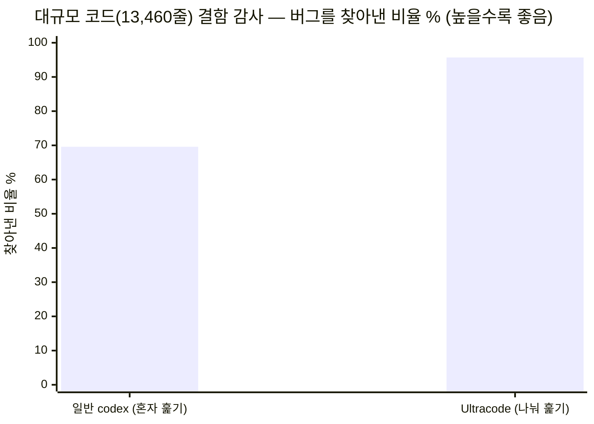
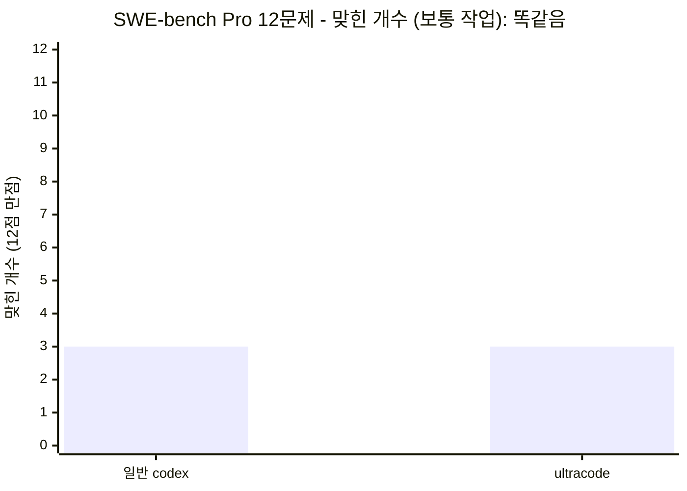
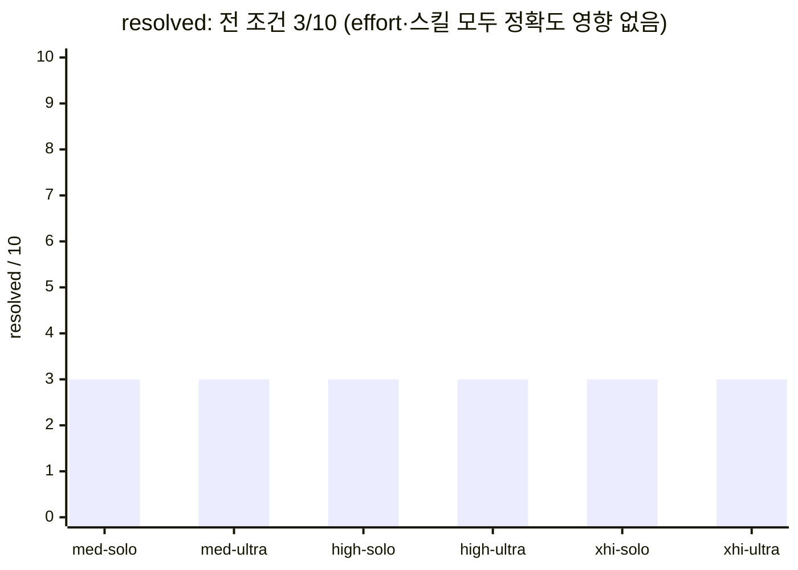
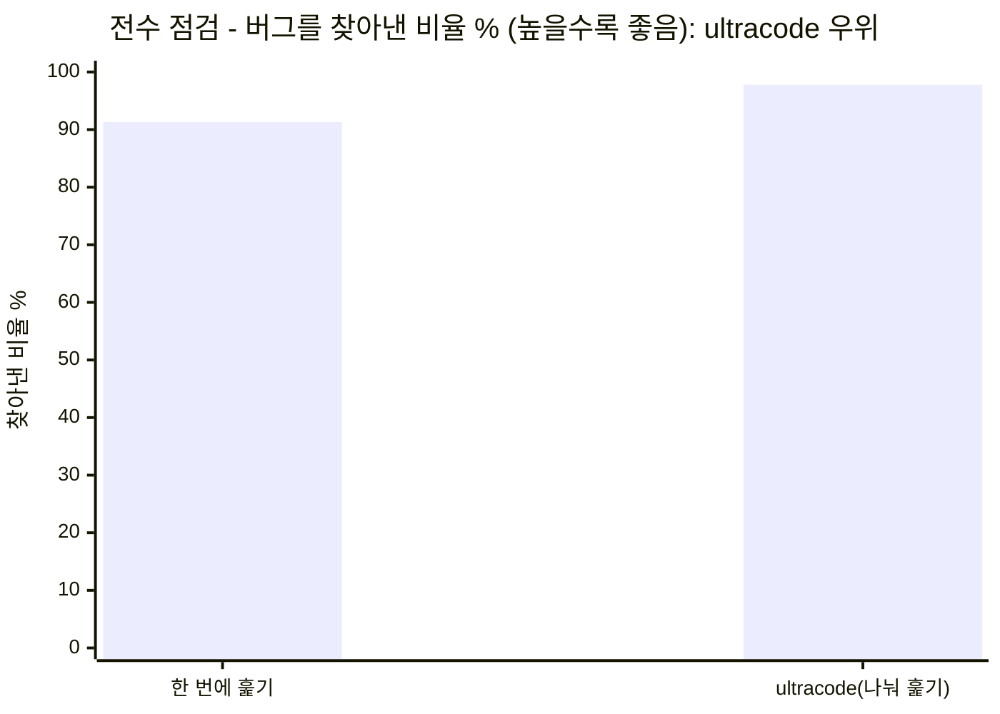
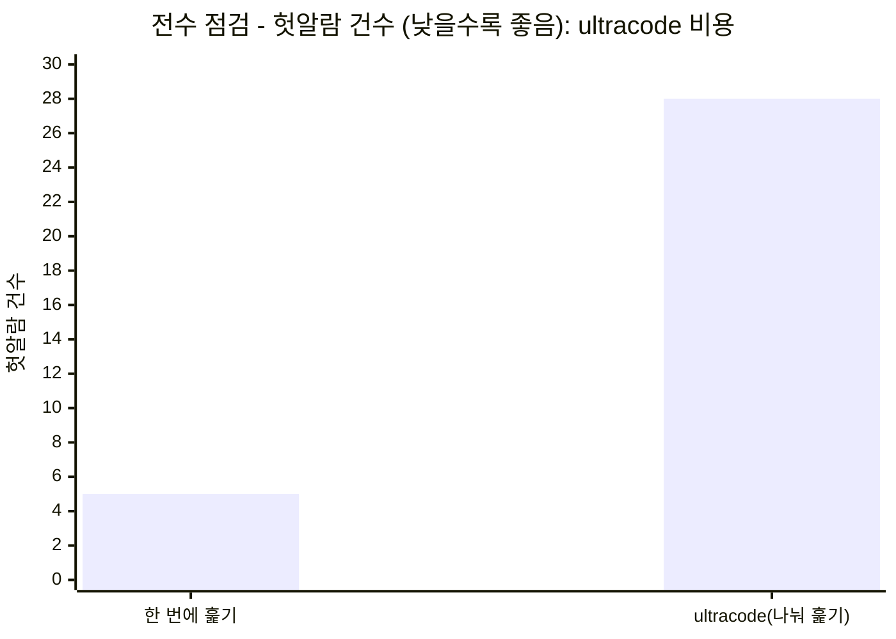
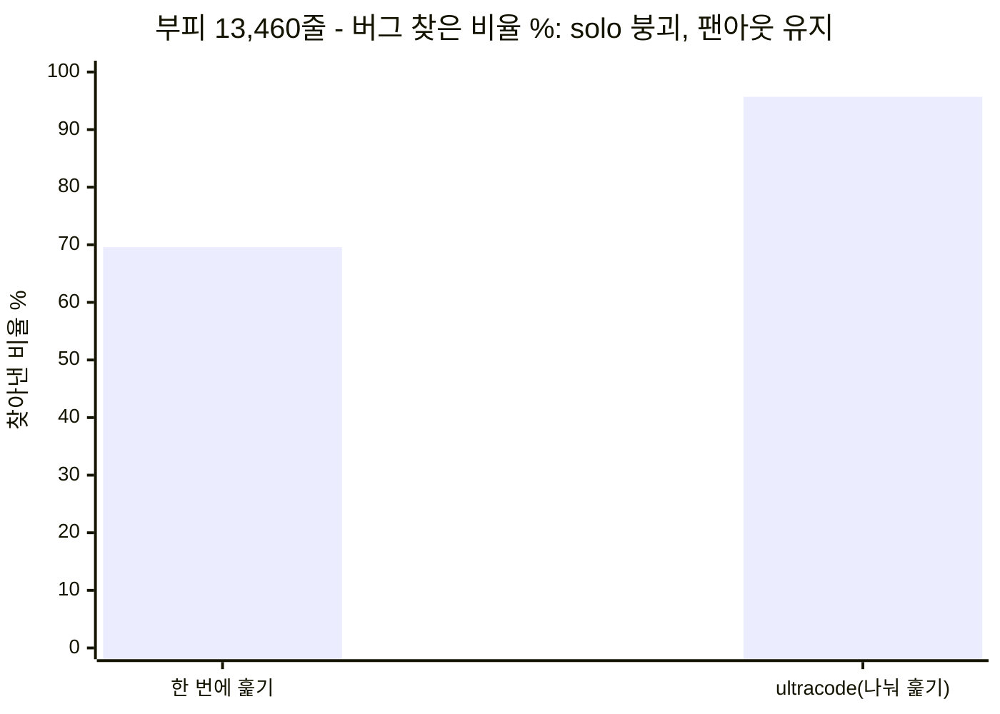
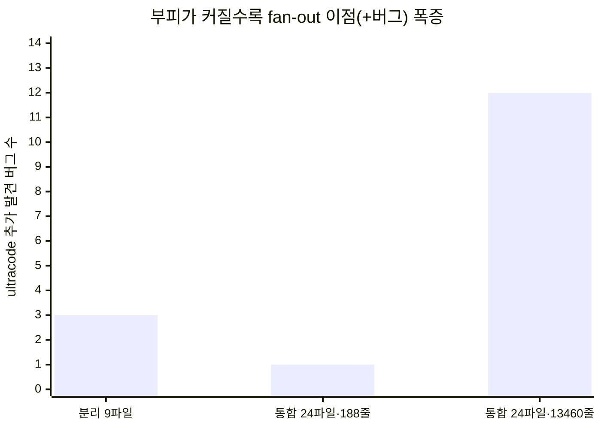
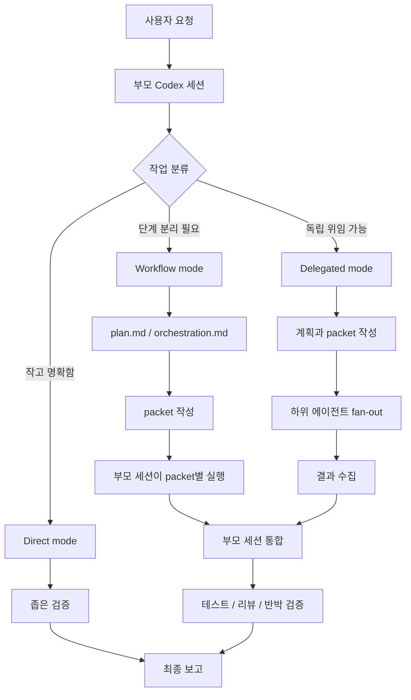

# Ultracode

## 한눈에 — 가장 큰 장점

**대규모 코드를 "버그 하나도 놓치면 안 되게" 감사할 때, 혼자 훑는 AI는 절반 가까이 놓치지만
Ultracode는 거의 다 잡습니다.**



같은 코드(24파일·13,460줄, 일부러 심어 둔 버그 46개)를 실제로 채점해 봤더니 — 혼자 한 번에 훑은
일반 codex는 **69.6%(14개 놓침)**, 작업을 여러 AI로 나눠 훑은 Ultracode는 **95.7%(+12버그 더 발견)**
였습니다. **코드 부피가 클수록 이 격차는 더 벌어집니다**(188줄 +1버그 → 13,460줄 +12버그).

> ⚖️ **솔직하게.** 보통의 작은 수정에서는 일반 codex와 점수가 똑같습니다(토큰만 더 씀).
> Ultracode는 "어디서나 정답률을 올려 주는 도구"가 아니라 **"대규모 전수 감사에서 누락을 줄이는
> 도구"**입니다. 전체 수치·측정 방법·한계는 아래 [벤치마크 절](#벤치마크--우리가-직접-측정한-것)에 전부 있습니다.

---

Ultracode는 Codex에서 복잡한 개발 작업을 **더 안전하게** 처리하기 위한 멀티 에이전트
워크플로우 스킬셋입니다. 작업을 한 번에 밀어붙이는 대신, 부모 세션이 목표를 정리하고 →
일을 나누고 → 필요하면 하위 에이전트에 위임하고 → 결과를 증거와 테스트로 검증해 통합합니다.

이 저장소는 Claude Code에서 쓰이던 Ultracode와 workflow 운영 아이디어를 참고해, Codex의
skill/subagent 환경에 맞게 다시 구성한 버전입니다. 공식 이식본도, Claude Code Workflow
런타임 복제도 아닙니다. 같은 문제의식을 Codex 방식으로 재해석한 스킬셋입니다.

솔직한 한 줄 결론부터 말하면 — **Ultracode는 "보통의 코드 수정을 더 잘하게 해 주는 도구"가
아닙니다.** "코드 전체를 빠짐없이 훑어야 하는 전수 감사"에서 빛나는 도구입니다. 이 차이를
막연한 주장이 아니라 이 저장소의 `bench/` 실측으로 직접 증명했고, 그 수치와 분석을 아래에
토글 없이 한 페이지에 전부 펼쳐 둡니다.

> **이 문서 읽는 법**
> 주니어 개발자는 위에서부터 순서대로 읽으면 됩니다. 비유 → 실측 → 사용법 순으로 자연스럽게
> 이어집니다. 시니어/AI 엔지니어는 "벤치마크" 절의 표와 **▸ 심화** 단락을 바로 봐도 됩니다.
> 모든 수치는 `bench/REPORT.md`(사이클 1–8)와 원자료 JSON에서 가져온 실측값입니다.

---

## 배경 — 먼저 알아 두면 좋은 것들

아래 내용을 처음 보는 분을 위해, 이 문서에 계속 나오는 핵심 용어를 먼저 풀어 둡니다. 이미 아는
분은 건너뛰어도 됩니다.

- **Codex** — OpenAI가 만든 코딩 에이전트 CLI(터미널에서 돌리는 AI 코딩 도구). 이 플러그인이
  올라타는 "호스트(host, 플러그인을 실제로 실행해 주는 본체)"입니다.
- **플러그인 / 스킬(skill)** — Codex에 기능을 더하는 확장입니다. 스킬은 "이렇게 일하라"는 규칙
  묶음(`SKILL.md` 파일)이고, 프로그램을 실행하는 게 아니라 AI에게 줄 **지시문(프롬프트)에 규칙을
  얹어 주는** 방식입니다. 그래서 설치가 가볍고 켜고 끄기가 쉽습니다.
- **에이전트(agent) / 서브에이전트(subagent)** — 에이전트는 스스로 파일을 읽고 명령을 실행하며
  일하는 AI 한 명이라고 보면 됩니다. 서브에이전트는 그 에이전트(부모)가 작업 일부를 떼어 맡기는
  보조 AI입니다.
- **fan-out(팬아웃, 나눠 맡기기)** — 한 작업을 여러 서브에이전트에게 동시에 쪼개 맡기는 것.
  반대말은 **single pass(단일 패스) / solo** — 한 명이 처음부터 끝까지 혼자 하는 방식입니다.
- **토큰(token)** — AI가 읽고 쓰는 텍스트의 최소 단위(대략 단어 조각). "토큰을 더 쓴다 = AI가 더
  많이 읽고/생각하고/쓴다 = 시간·비용이 더 든다"로 이해하면 됩니다.
- **SWE-bench Pro** — 실제 오픈소스 저장소의 버그를 AI가 고치게 하고, **숨겨 둔 테스트**로
  채점하는 공개 벤치마크(AI 코딩 실력 표준 시험). 테스트를 통과하면 "해결(resolved)"로 칩니다.
  이 문서에서 "보통의 코드 수정"을 대표하는 시험입니다.

이 다섯 개만 알면 아래 벤치마크 절을 읽는 데 무리가 없습니다. recall·헛알람 같은 측정 용어는
[벤치마크 절의 "용어 세 개"](#먼저-용어-세-개)에서 다시 자세히 풉니다.

---

## 벤치마크 한눈에

이 저장소 `bench/` 실측 요약입니다. 자세한 표와 분석은 아래 [벤치마크](#벤치마크--우리가-직접-측정한-것) 절에 있습니다.

- **단일 수정 정확도 — 이득 없음(솔직히 인정).** 업계 표준 시험 SWE-bench Pro에서 일반
  codex와 점수가 똑같습니다(3/12, 맞힌 문제까지 동일). `medium·high·xhigh` 어느 추론 강도에서도
  동일했습니다. 더 깊게 생각시켜도, 멀티에이전트를 붙여도 못 올립니다 — 실패 원인이 "주어지지
  않은 정보(held-out)"라서 그렇습니다.
- **전수 감사 완전성 — 실측 이득.** 일부러 심어 둔 버그를 찾는 작업에서 버그 recall이 단일
  패스보다 높았습니다(91.3% → 97.8%, +6.5%p). 그리고 **코드 부피가 커지면 격차가 폭증**합니다
  (13,460줄에서 69.6% → 95.7%, **+12버그**).
- **핵심 구분 — 이점을 키우는 변수는 "파일 수"가 아니라 "코드 부피"입니다.** 작은 파일을 24개로
  늘려도 이점은 노이즈(+1버그)였지만, 같은 24파일을 13,460줄로 키우자 폭증했습니다.
- **비용 — 토큰이 늘어납니다.** ultracode는 solo보다 토큰 약 1.1배, 추론 강도를 올리면 최대
  약 2.3배. 헛알람(false positive)도 5건 → 28건으로 늘어납니다.

```text
요청
 → 작업 분류
 → 계획
 → 조사 / 구현 / 검증으로 분해
 → 가능한 경우 하위 에이전트 위임
 → 부모 세션이 증거와 테스트로 통합
 → 최종 보고
```

---

## 이 스킬셋은 무엇인가

Ultracode는 실행 파일이나 별도 런타임(runtime, 독립적으로 도는 실행 엔진)이 **아닙니다.**

- Codex가 읽는 `SKILL.md` 기반 스킬셋입니다.
- 복잡한 작업을 계획, 분해, 위임, 검증하는 운영 규칙입니다.
- Codex의 native agent, slash command, MCP, review, sandbox 정책을 조합해 사용합니다.
- 명시적으로 `$ultracode`를 호출할 때만 쓰는 것을 기본으로 합니다.

Ultracode가 제공하지 않는 것도 분명합니다.

- 공식 OpenAI, Claude, Google 기능이 아닙니다.
- Claude Code Workflow 런타임을 구현하지 않습니다.
- JavaScript/Python runner를 제공하지 않습니다.
- MCP server, 브라우저 자동화 서버, 배포 도구를 포함하지 않습니다.

스킬이란 결국 **컨텍스트 주입**입니다. Codex 세션에 "이렇게 일하라"는 운영 규칙
(`SKILL.md`)을 얹어 주는 것이고, 그래서 별도 프로그램 설치 없이 프롬프트 한 줄로 켜고 끌 수
있습니다.

---

## 왜 이런 게 필요한가

작은 수정은 그냥 직접 처리하는 편이 낫습니다. 오타 수정, 파일 하나 요약, 명령 하나 실행 같은
일에 Ultracode를 쓸 필요는 없습니다.

문제는 **AI 한 명이 큰 코드를 혼자 훑을 때 생기는 습성**입니다. AI는 "이만하면 충분히 봤다"고
판단하면 멈추는 경향(satisficing)이 있고, 긴 입력일수록 뒤로 갈수록 주의가 흐려집니다
(attention decay). 그래서 미묘한 버그가 큰 파일 깊숙이 묻혀 있으면 그냥 지나칩니다. 아래 실측에서
바로 이 현상이 숫자로 드러납니다(13,460줄에서 단일 패스 recall이 91% → 69.6%로 무너집니다).

Ultracode는 다음처럼 **놓치는 비용이 큰 작업**에 맞습니다.

- 저장소 전체 구조를 먼저 이해해야 하는 기능 구현
- 재현이 어렵거나 원인 후보가 여러 개인 복잡한 디버깅
- 스펙 문서가 있고 구현 범위가 긴 기능 개발
- 인증, 결제, 데이터 마이그레이션처럼 실패 비용이 큰 변경
- 여러 파일, 테스트, 문서가 함께 바뀌는 작업
- 풀 리퀘스트 전 독립적인 검증이 필요한 변경
- "정말 빠진 게 없는지" 반박 관점으로 확인해야 하는 검증

핵심 가치는 속도가 아니라 **신뢰도**입니다. 한 세션이 혼자 결론을 내리지 않고, 작업을 나누고
독립 검증을 거친 뒤 부모 세션이 책임지고 합칩니다.

---

## Ultracode가 쓰는 두 가지 방법 (비유로)

어려운 문제를 풀 때 Ultracode는 두 가지 레버를 씁니다.

1. **한 명이 더 오래 고민하게 하기** — Codex의 추론 강도(`model_reasoning_effort`)를 `xhigh`까지
   올립니다. Codex 기본값은 `medium`이고, 지연에 둔감한 어려운 작업에 `xhigh`를 권장합니다.
2. **여러 명에게 나눠 맡기고 합치기** — 작업을 여러 AI(서브에이전트)에 쪼개 각자 맡은 부분을
   깊게 본 뒤 결과를 합칩니다. 서브에이전트는 Codex의 native 기능입니다(내장 에이전트
   `default`·`worker`·`explorer`). 이 "나눠서 맡기고 합치는" 방식을 dynamic workflow(멀티에이전트)라고 부릅니다.

두 방법의 원리는 같습니다. **AI가 생각을 더 많이 할수록(= 더 많은 "토큰"을 쓸수록) 결과가
좋아진다**는 것입니다. (연구에 따르면 성능 차이의 약 80%가 "토큰을 얼마나 썼는가"로 설명됩니다.)

> **⚠️ 출처를 정직하게 구분합니다.** `xhigh` 추론 모드와 서브에이전트는 **Codex의 native
> 기능**입니다(아래 공식 문서). 이를 "스킬"로 조직하는 워크플로 설계는 **Claude Code Workflow를
> 참고**한 것이고, "토큰이 분산의 ~80% 설명" 같은 수치는 **Anthropic 멀티에이전트 연구의
> 결과**이지 codex-ultracode가 Codex에서 다시 측정한 값이 아닙니다. 아래 "벤치마크" 절의 수치만
> 이 저장소가 직접 측정한 값입니다.

**▸ 심화 (AI 엔지니어용).** 두 레버는 **test-time compute**(추론 시점 연산)를 키우는 두 축입니다.
레버 1(`xhigh`)은 한 정책의 *순차적* 사고 깊이(reasoning-token 예산)를 늘리고, 레버 2(서브에이전트)는
*병렬* 표본 수와 유효 컨텍스트를 늘립니다. Anthropic이 보고한 "토큰 사용량이 분산의 ~80% 설명"은
test-time scaling 곡선의 한 단면으로, 두 축이 같은 곡선을 다른 방향으로 탑니다. 단 축별 한계 효용은
작업의 **분해 가능성(decomposability)**과 **검증 가능성(verifiability)**에 따라 급변하며(아래 측정)
무조건 단조 증가가 아닙니다. 비용 모델: 서브에이전트는 컨텍스트를 공유하지 않아 조정 비용과
per-agent 토큰이 곱으로 늘어 약 15배 토큰까지 갈 수 있습니다(Anthropic 보고치).

---

## 벤치마크 — 우리가 직접 측정한 것

여기서부터가 핵심입니다. "Ultracode가 좋은가/나쁜가"를 감이 아니라 숫자로 답합니다.

### 먼저 용어 세 개

- **recall(찾아낸 비율):** 숨겨 둔 버그 중 실제로 몇 개나 찾았는지. 높을수록 "놓친 게 적다".
- **헛알람(false positive, FP):** 사실은 문제가 아닌데 "문제다"라고 잘못 보고한 것. 적을수록 좋다.
- **숨겨 둔 정답(held-out):** 채점할 때만 쓰는, AI에게는 보여 주지 않는 정답. 예를 들어 채점
  테스트가 요구하는 *정확한 에러 문구* 같은 것. AI에게 주어지지 않은 정보다.

### 어떻게 측정했나 (설정)

수치를 믿으려면 어떻게 쟀는지부터 알아야 합니다.

- **단일 수정 측정 (사이클 1–4, 8 / SWE-bench Pro A/B):** base = `codex` CLI **0.133.0**. 사이클
  1–4는 모델·추론 강도를 하니스에서 고정하지 않음 → codex 기본값(`medium`) 사용. 사이클 8은
  `model_reasoning_effort`를 medium/high/xhigh로 명시 고정. `approval_policy="never"`(중간 승인
  없이 끝까지 자동 실행), `workspace-write`(작업 폴더만 쓰기 허용하는 샌드박스), 생성 타임아웃
  420–600초. 채점 =
  **Modal(코드를 격리 실행해 주는 클라우드)에서 공식 Scale 하니스(채점 프로그램)
  `swe_bench_pro_eval.py`(`jefzda` 이미지) 실행**. resolved(해결) 판정 = `FAIL_TO_PASS`(수정 전엔
  실패하다 수정 후 통과해야 하는 테스트)와 `PASS_TO_PASS`(원래도 통과하던, 깨지면 안 되는 테스트)가
  **둘 다 전부 통과**해야 함.
- **전수 감사 측정 (사이클 5–7 / recall):** 양 arm 모두 **Claude Opus 4.8**(세션 모델), effort =
  **xhigh**(워크플로 서브에이전트는 메인 루프 모델·effort를 상속). 일부러 버그를 심은 코드베이스를
  **별도 에이전트가 blind 채점**(정답을 모른 채, 발견한 것을 ground truth[정답표]에 대조해 채점).
- 데이터셋: `ScaleAI/SWE-bench_Pro`(test split = 채점용 문제 묶음), strided(전체에서 일정 간격으로
  고르게 뽑은) n=12. 감사 픽스처(fixture = 일부러 버그를 심어 둔 테스트용 코드): `bench/recall/fixtures/`.

> 참고로 SKILL 자체도 벤치마크로 다듬었습니다. 초기 560줄 "최대 fan-out, 비용 무시" 스킬은 단순
> 코딩에서 순수 codex보다 **약 7배 느리기만 했고**, 이를 근거 기반으로 74줄("검증은 철저히,
> fan-out은 가치 기준으로")로 재작성하자 **같은 정확도를 약 6배 싸게**(233s → 39s) 냈습니다
> (사이클 1). 즉 지금의 스킬은 "비싸기만 한 버전"을 실측으로 걷어낸 결과물입니다.

### 결과 1 — 보통의 코드 수정 → 점수가 똑같습니다 (인정)

업계 표준 시험 SWE-bench Pro 12문제를 실제 채점기로 돌려 보면, ultracode를 켜든 끄든 결과가
같았습니다. 12개 중 같은 3개를 맞히고, **틀린 문제까지 똑같았습니다.**



| 방법 | 맞힌 개수 |
| --- | --- |
| 일반 codex (solo) | 3 / 12 |
| ultracode | 3 / 12 (똑같음, 맞힌 문제까지 동일) |

맞힌 3개: `NodeBB-04998908`(js), `internetarchive/openlibrary-92db3454`(py),
`qutebrowser-34a13afd`(py). 멀티에이전트 레버 — best-of-N(여러 후보 답을 만들어 그중 최선을 고름)
\+ 독립 적대 검증(다른 AI가 "이거 틀렸다"고 트집 잡아 반박) + repair(반박당한 부분만 고침) — 를
**실제 codex 서브프로세스(별도 codex 실행)로** 발동시킨 사이클 4의 `orch` arm(오케스트레이션 군)도
결과가 완전히 동일했습니다 — 새로 맞힌 문제 0건, 원래 맞히던 게 깨진 것 0건, 비용만 5~8배.

**왜 차이가 없을까요?** 이 문제들을 틀리는 이유는 "채점 테스트가 요구하는 정확한 에러 문구" 같은
*숨겨 둔 정답*을 못 맞혀서인데, 그 정답은 AI에게 주어지지 않습니다. **주어지지 않은 정보는 AI를
여러 명 붙여도 알아낼 수 없습니다.** 그래서 보통의 단일 수정 작업에서는 **ultracode가 토큰만 더
쓰고 점수는 그대로입니다.** 이 점은 솔직하게 인정합니다.

**▸ 심화.** 이 동률은 오케스트레이션(orchestration, 여러 에이전트를 나눠 지휘·조율하는 것) 실패가
아니라 **정보 이론적 상한(아무리 잘 풀어도 못 넘는 한계)**입니다. SWE-bench Pro의 판정
신호(FAIL_TO_PASS의 `assert.EqualError` 등)는 에이전트의 관측 입력에 존재하지 않는 held-out
사양이라, 과제가 입력만으로 과소결정(underdetermined, 주어진 정보만으론 답이 하나로 안 좁혀짐)됩니다.
팬아웃·적대 검증·best-of-N은 **탐색으로 줄일 수 있는 불확실성(epistemic — 더 알아보면 해소되는 것)**에는
듣지만, 여기 실패는 **줄일 수 없는 본질적 모호성(aleatoric — 아무리 탐색해도 못 줄이는 것)**입니다.
best-of-N도 후보 중 무엇이 정답인지 골라 줄 **유효한 기준(in-distribution oracle, 예: 풍부한
`PASS_TO_PASS`)**이 있어야 작동하는데 Pro 인스턴스는 그게 비어 있는 경우가 많습니다(flipt
`pass_to_pass=[]`). flipt의 gold patch(데이터셋이 제공하는 모범 정답)와 대조해 확인: 에이전트는 의미는
맞지만 표현이 다른 에러 문자열을 내서 byte-exact 매칭(글자 하나까지 똑같아야 통과)에 실패했습니다.

근거: `bench/REPORT.md`(사이클 3·3b·4) · 원자료 `bench/results_pro12.json`,
`bench/results_orch12.json`, `bench/preds12/`.

### 결과 2 — 추론을 더 깊게 시켜도 동일, 토큰만 증가 (effort 매트릭스)

"그럼 추론 강도를 올리면 다르지 않을까?"라는 자연스러운 의심에 답하려고, medium/high/xhigh × {solo,
ultracode} 6개 조건을 SWE-bench Pro 10인스턴스(ansible 2개 제외)에서 측정했습니다(사이클 8).




| effort | arm | resolved | 평균 토큰(total) |
| --- | --- | :-: | --: |
| medium | solo | 3/10 | 1.37M |
| medium | ultracode | 3/10 | 1.49M |
| high | solo | 3/10 | 1.82M |
| high | ultracode | 3/10 | 2.13M |
| xhigh | solo | 3/10 | 3.17M |
| xhigh | ultracode | 3/10 | 3.10M |

6개 조건 전부 **resolved 3/10, 같은 인스턴스**였습니다. 추론 강도를 medium → xhigh로 올리면 토큰은
약 2.3배 늘지만 정확도는 그대로고, ultracode도 모든 effort에서 solo와 동률(토큰만 paired[같은 문제끼리
짝지어 비교] 1.08~1.16배 더)이었습니다. **결과 1의 정보 상한이 effort 축으로도 그대로 확인된 셈입니다** — 추론을 더 해도,
스킬을 줘도, 없는 정보는 못 만들어 냅니다. 두 레버 모두 토큰만 더 쓸 뿐입니다.

근거: `bench/REPORT.md`(사이클 8) · 원자료 `bench/results_medium.json`, `bench/results_high.json`,
`bench/results_xhigh.json`.

### 결과 3 — 코드 전체에서 결함을 빠짐없이 찾기 → 여기서 앞섭니다

반대로 "하나라도 빠뜨리면 실패"인 작업에서는 ultracode가 더 많이 찾아냅니다. 일부러 버그를 심어 둔
코드베이스 3개(버그 합계 46개)에서, **한 명이 한 번에 훑기**와 **여러 AI로 나눠 훑고 합치기**를
비교했습니다(사이클 5).





| 지표 | 한 번에 훑기 | ultracode(나눠 훑기) | 뜻 |
| --- | --- | --- | --- |
| 찾아낸 비율(recall) | 46개 중 42개(91.3%) | 46개 중 45개(97.8%) | ultracode가 **버그를 덜 놓칩니다** |
| 헛알람(FP) | 5건 | 28건 | ultracode는 **헛알람이 더 많습니다** |

픽스처별로 보면 이점이 **조건부**라는 게 드러납니다.

| 픽스처 (도메인) | 심은 버그 | solo recall | ultra recall | solo FP | ultra FP |
| --- | :-: | :-: | :-: | :-: | :-: |
| utils (미묘한 버그) | 18 | 15/18 | 17/18 | 5 | 16 |
| http (명백한 보안버그) | 14 | 14/14 | 14/14 | 0 | 8 |
| collections (혼합) | 14 | 13/14 | 14/14 | 0 | 4 |
| **합계** | **46** | **42 (91.3%)** | **45 (97.8%)** | **5** | **28** |

**쉽게 풀면 이렇습니다.** 한 명이 혼자 훑으면 "이만하면 됐다" 하고 미묘한 버그를 놓치곤 합니다
(utils). 일을 여러 AI에게 나눠 맡기면 그 놓친 것까지 잡아내서 recall이 **91.3% → 97.8%**로 올랐습니다.
단 이점은 *버그가 미묘할 때만* 나타납니다. SQL 주입처럼 한눈에 보이는 버그(http)는 한 번 훑기로도
이미 다 잡혀서(14/14) 이득이 0입니다. 그리고 그 대가로 **헛알람이 5건 → 28건(5.6배)으로 모든 시행에서
일관되게 늘었습니다.** 즉 ultracode의 장점은 "빠뜨리지 않는 것", 비용은 "확인해야 할 헛알람이 늘어나는
것"입니다.

> **Codex 공식 문서와도 일치합니다.** Codex 서브에이전트 문서는 서브에이전트가 "코드베이스 탐색이나
> 여러 비슷한 항목을 감사하는 것처럼 고도로 병렬적인 작업"에 적합하고, "서브에이전트 워크플로는 단일
> 에이전트 실행보다 토큰을 더 쓴다"고 설명합니다. 우리 실측의 두 결과 — 전수 점검에서 더 잘 찾음,
> 그리고 토큰·헛알람 비용 증가 — 와 정확히 들어맞습니다.

**▸ 심화.** 이는 탐지 과제의 **recall(재현율, 진짜 버그 중 찾은 비율)–precision(정밀도, 보고한 것 중
진짜인 비율) 트레이드오프**입니다. 팬아웃은 조각별 주의(per-chunk attention)를 유지해 단일 패스의
satisficing(이만하면 됐다며 조기 종료)과 attention decay(뒤로 갈수록 주의가 흐려짐)를 완화하여 recall을
올리지만, 완전성 비평은 false-discovery rate(보고분 중 헛것의 비율)도 함께 끌어올립니다 — 이 크기대에선
F1(recall과 precision을 합친 종합 점수)이 오히려 solo 우위. 최적 동작점은 **비용 비대칭**이 결정합니다 —
놓침(miss) 비용이 헛알람을 걸러 확인하는(triage) 비용보다 훨씬 크면(보안·규정 감사) 고-recall 설정이
정당하고, 반대면 solo가 낫습니다. 그래서 SKILL은 넓게 펼친(breadth) 팬아웃 산출을 보고 전에
**생성기/검증기 분리**(찾는 AI와 반박하는 AI를 나누고, 기본값을 "문제 아님"으로 두는 적대 검증 게이트)로
통과시켜 precision 손실을 일부 되돌립니다.

근거: `bench/REPORT.md`(사이클 5) · `bench/recall/README.md` · 픽스처 `bench/recall/fixtures/`.

### 결과 4 — 이점을 키우는 건 "파일 수"가 아니라 "코드 부피"입니다

여기가 가장 중요한 발견입니다. 직관적으로는 "파일이 많아지면 단일 패스가 더 헤매니 fan-out이 유리하다"고
생각하기 쉬운데, **실측은 그 가설을 반증**했습니다.

먼저 사이클 5의 코드베이스 3개(버그 46개)를 **24파일·단 188줄**의 한 코드베이스로 합쳐 봤습니다(사이클 6).

| 지표 | solo | ultracode(팬아웃) |
| --- | :-: | :-: |
| recall | 43/46 (93.5%) | 44/46 (95.7%) |
| 찾은 수 | 46 | 72 |
| 헛알람(FP) | 6 | 10 |

파일을 9 → 24개로 늘렸는데도 이점은 커지기는커녕 **노이즈 수준(+1버그)으로 축소**됐습니다. 188줄은
작아서 24파일도 한 컨텍스트에 다 들어가기 때문입니다. "파일 수"만으로는 단일 패스가 무너지지 않습니다.

그래서 이번엔 같은 24파일을 파일당 약 560줄의 clean filler(버그 없는 정상 코드로 채운 부피)로 묻어
**24파일·13,460줄(약 107K 토큰)**로 부피를 키워 다시 측정했습니다(사이클 7).



| 지표 | solo | ultracode(팬아웃) |
| --- | :-: | :-: |
| recall | 32/46 (**69.6%**) | 44/46 (95.7%) |
| 찾은 수 | 33 | 60 |
| 헛알람(FP) | 2 | 13 |

부피가 188줄 → 13,460줄로 커지자 **solo recall이 91~93%에서 69.6%로 붕괴**한 반면 팬아웃은 95.7%를
유지했습니다. 이점이 +1버그에서 **+12버그(+26.1%p)**로 폭증했습니다. 단일 패스는 약 107K 토큰을 한
번에 훑으며 satisfice → 큰 파일에 묻힌 버그를 대량 누락하는데, 팬아웃은 각 에이전트가 약 1,680줄만
깊게 봐서 recall을 유지합니다.

**핵심 구분(사이클 6 vs 7):** fan-out 이점을 키우는 변수는 **"파일 수"가 아니라 "부피(코드 양)"**입니다.



**▸ 심화 / 정직한 한계.** 107K 토큰은 크지만 Opus 컨텍스트 창(200K+) 안이라 "하드 윈도 초과"는
아닙니다 — 모델이 다 읽을 수는 있으나 큰 부피에서 주의가 분산됐습니다. 추세(188줄 +1버그 → 13,460줄
+12버그)는 "부피가 클수록 fan-out 우위가 커진다"를 강하게 지지하며, 진짜 윈도 초과(>200K 토큰)에서는
더 벌어질 것으로 예상되지만 **이 영역은 미측정**입니다 — 차용한 원리(Claude)로만 뒷받침되고 자체
측정이 남은 과제입니다.

근거: `bench/REPORT.md`(사이클 6·7) · `bench/recall/README.md`.

### 솔직한 한계 (threats to validity)

수치를 과대 해석하지 않도록 약점을 그대로 적습니다.

- **조건당 단일 시행.** LLM은 비결정적이라 같은 입력도 결과가 흔들립니다. 절대 마진(특히 사이클
  5·6의 +1~3버그)은 작아서 방향성(directional)으로만 읽어야 합니다. 사이클 7의 +12버그는 마진이
  커서 비교적 견고합니다.
- **합성 코드베이스.** 감사 픽스처는 일부러 버그를 심은 인공 코드입니다. 실제 프로덕션 코드와
  분포가 다를 수 있습니다.
- **진짜 컨텍스트 초과는 미검증.** 가장 이점이 클 것으로 예상되는 ">200K 토큰" 영역은 측정하지
  못했습니다(위 ▸심화 참조).
- **단일 수정 측정은 codex 기준.** 사이클 1–4·8은 codex CLI로, 사이클 5–7은 Claude Opus로
  측정했습니다. 호스트 모델이 다르면 절대 수치는 달라질 수 있습니다(상대 비교는 각 arm 내부에서
  동일 모델로 했으므로 유효).

### 정리 — 언제 쓰면 좋은가

| 작업 종류 | 우리 벤치 결과 | 결론 |
| --- | --- | --- |
| 보통의 단일 수정 | 점수 동일(effort 무관) | **굳이 쓸 필요 없음 (토큰만 더 듦)** |
| 빠짐없이 찾아야 하는 전수 점검·리뷰 | 더 많이 찾음(+6.5%p) | **쓸 가치 있음 (단, 헛알람 감수)** |
| 파일이 많은 작업 (24파일·188줄) | 이점이 노이즈(+1버그), 헛알람 비용은 지속 | **파일 수만으론 이점 안 커짐** (사이클 6) |
| 대규모 부피 (24파일·13,460줄·~107K토큰) | solo recall 91–93% → **69.6% 붕괴**, 팬아웃 95.7% 유지 | **부피가 크면 이점 폭증** (+12버그, 사이클 7) |
| 진짜 윈도 초과 (>200K 토큰) | 미측정 — 추세상 더 벌어질 것으로 예상 | **미검증** |

한 줄로 요약하면, **codex-ultracode가 벤치마크로 직접 증명한 장점은 "대규모 전수 점검에서 버그를 덜
놓치는 것"이고, 보통 작업에서는 점수가 같습니다.**

---

## 장점과 단점

벤치마크에서 곧장 도출되는 트레이드오프입니다.

**장점**

- **대규모 코드 전수 감사에서 누락이 적습니다.** 부피가 클수록(13,460줄에서 단일 패스 69.6% 대비
  95.7%) 격차가 벌어집니다. miss 비용이 큰 보안·규정·릴리스 전 감사에 강합니다.
- **검증 규율이 강제됩니다.** 주장은 "실행한 명령 + 그 출력"으로만 인정하고, 버그는 고치기 전에
  먼저 재현하며, 증상이 아니라 계약/근본 원인을 고치도록 게이트가 걸립니다.
- **과신을 차단합니다.** 부모 세션이 하위 에이전트 결과를 그대로 믿지 않고 증거로 재검증하며,
  검증 못 한 항목은 보고서에 그대로 "unverified"로 남깁니다.
- **켜고 끄기가 쉽습니다.** 런타임 설치가 아니라 프롬프트 한 줄(`$ultracode`)로 명시 호출합니다.

**단점**

- **보통 작업의 정확도는 못 올립니다.** SWE-bench Pro에서 effort·스킬 무관하게 일반 codex와 동률.
  단일 수정에는 토큰 낭비입니다.
- **헛알람이 늘어납니다.** recall을 올리는 대가로 false positive가 5 → 28건(약 5.6배)으로 증가 —
  triage 비용이 듭니다.
- **토큰 비용이 큽니다.** solo 대비 약 1.1배, effort를 올리면 최대 약 2.3배. 멀티에이전트 팬아웃은
  더 듭니다(원리상 최대 약 15배).
- **작은/결합 작업엔 역효과.** 단계가 서로 의존하는 작업을 무리하게 쪼개면 정확도 이득 없이 비용만
  늘고, 완전성 비평이 noise를 양산합니다.

---

## 구성 원리

Ultracode의 중심은 "**부모 세션이 책임지고, 필요한 일만 하위 에이전트에 나눈다**"는 구조입니다.
하위 에이전트가 많아지는 것이 목표가 아니라, 작업을 분해하고 서로 다른 관점으로 검증하는 것이
목표입니다.



구성 요소는 다음처럼 나뉩니다.

- **부모 세션:** 작업 분류, 계획, 통합, 최종 판단을 담당합니다.
- **packet:** 조사, 구현, 검증처럼 독립적으로 수행할 수 있는 작은 작업 단위입니다.
- **하위 에이전트:** packet을 받아 독립적으로 조사하거나 검증합니다. 쓸 수 없으면 부모 세션이
  단계별로 대체 실행합니다.
- **artifact:** `plan.md`, `orchestration.md`, `state.json`, packet/result 파일처럼 실행 과정을
  남기는 기록입니다. Codex에서는 기본적으로 `${CODEX_HOME:-$HOME/.codex}/log/ultracode/` 아래에
  남기고, 추후 개선 분석을 위해 `metrics.json`과 `summary.jsonl`도 함께 기록합니다.
- **반박 검증(adversarial verify):** 나온 결론이 틀렸다고 가정하고 다시 확인하는 단계입니다.
  독립 회의론자들이 "기본값은 문제 아님"에서 시작해 다수결로 판정하고, 라운드는 최대 2회로 막아
  drift를 방지합니다.

Codex에서 native subagent가 가능하면 `Delegated mode`가 가장 완전한 형태입니다. 그 기능이 없거나
막혀 있으면 `Workflow mode`로 같은 절차를 단일 세션 안에서 재현하고, **왜 위임하지 않았는지 최종
보고에 남깁니다.** 아주 작은 작업은 `Direct mode`로 바로 처리합니다.

---

## 실행 모드

Ultracode는 작업 크기와 환경에 따라 세 가지 방식으로 동작합니다.

| 모드 | 언제 쓰는가 | 동작 |
| --- | --- | --- |
| **Direct mode** | 작고 명확한 작업(오타 하나, 명백한 한 줄 수정) | 부모 세션이 바로 처리하고 가장 좁은 실제 검증만 합니다. artifact 없음. |
| **Single loop (코딩 기본)** | 대부분의 코드 변경(편집이 서로 의존) | 한 에이전트가 localize(버그 위치 특정) → 실패하는 테스트 작성 → 근본 원인 수정 → 실제 테스트 실행 → 통과(green)할 때까지 디버그. 멀티에이전트 비용 없이 품질 이득 대부분을 가져갑니다. |
| **Delegated fan-out** | 하위 작업이 진짜로 독립적일 때(겹치지 않는 파일/모듈, breadth-first[넓게 펼쳐 찾기] 탐색, 독립 검증 패스) | 조사·구현·검증 packet(작업 단위)을 하위 에이전트에 나누고 부모 세션이 통합. 동시에 같은 파일을 고치는 충돌 우려가 있으면 worktree(git 작업 복사본, 저장소를 복제해 독립 폴더에서 작업)로 격리. |

핵심은 **"야망이 아니라 작업 형태로 모드를 고른다"**입니다. 단일 응집 수정을 무리하게 쪼개면 비용만
늘고, 진짜 분해 가능한 breadth 작업에서만 fan-out이 값을 합니다(위 벤치마크가 정확히 이 경계를
보여 줍니다).

---

## 설치 방법

이 저장소는 Codex 플러그인 구조를 따릅니다. 플러그인으로 설치하면 `skills/ultracode`가 Codex skill로
로드됩니다.

일반 사용자는 GitHub 저장소를 Codex marketplace로 등록한 뒤 플러그인을 설치합니다.

```bash
codex plugin marketplace add Jimmy-Jung/codex-ultracode --ref main
codex plugin add codex-ultracode@codex-ultracode --json
```

설치 상태 확인:

```bash
codex plugin list --json
```

플러그인 설치 대신 프로젝트 하나에서만 쓰려면 대상 프로젝트의 `.agents/skills/` 아래로 스킬 폴더만
복사합니다.

```bash
mkdir -p your-project/.agents/skills
cp -R skills/ultracode your-project/.agents/skills/ultracode
```

여러 프로젝트에서 개인 스킬처럼 쓰려면 사용자 스킬 폴더로 복사합니다.

```bash
mkdir -p ~/.agents/skills
cp -R skills/ultracode ~/.agents/skills/ultracode
```

설치 후 새 Codex 세션을 열고 명시적으로 호출합니다.

```text
$ultracode로 간헐적으로 실패하는 로그인 버그를 디버깅해줘.
```

`skills/ultracode/agents/openai.yaml`은 `allow_implicit_invocation: false`를 사용합니다. 즉, 평소
작업에 자동으로 끼어들지 않고 사용자가 `$ultracode`, `ultracode`, `ultra code`처럼 명시적으로 부를
때만 켜집니다.

---

## 사용 방법

가장 좋은 요청은 **목표, 범위, 모드, 제약, 검증 방법**을 함께 적는 것입니다.

```text
$ultracode로 <목표>를 수행해줘.
범위: <파일, 모듈, 저장소 범위>.
모드: <읽기 전용 검증 | 계획 먼저 | 조사 후 구현 | 검증만>.
제약: <수정 금지, 커밋 금지, 넓은 변경 전 확인 등>.
필수 검증: <테스트, 빌드, 린트, 문서 일치 검증 등>.
출력: <원하는 결과 형식>.
```

요청이 불명확하면 Ultracode는 바로 넓게 수정하지 않습니다.

```text
$ultracode로 이거 개선해줘.
```

이런 입력에서는 대상이 무엇인지 한 번만 짧게 묻거나, 더 안전한 프롬프트 형태로 다시 제안합니다.
대상은 보이지만 범위가 넓으면 먼저 read-only discovery로 근거를 모읍니다.

아래는 실제로 잘 맞는 요청 예시들입니다.

### 풀 리퀘스트 전 위험 변경 검증

```text
$ultracode로 결제 모듈 변경 사항을 풀 리퀘스트 전에 검증해줘.
범위: 변경된 파일, 결제 관련 테스트, 결제 API 경계.
모드: 검증만.
제약: 파일을 수정하지 말고 커밋하지 말 것.
필수 검증: 누락된 예외 케이스, 보안 위험, 회귀 가능성, 테스트 근거.
출력: 차단 이슈, 수정 권장 사항, 남은 위험.
```

### 복잡한 디버깅

```text
$ultracode로 간헐적으로 실패하는 로그인 버그를 디버깅해줘.
범위: 인증 모듈, 세션 처리, 로그인 관련 테스트.
모드: 조사 후 구현.
제약: 원인 가설을 먼저 정리하고, 대규모 수정 전에는 확인할 것.
필수 검증: 재현 경로, 로그나 테스트 근거, 수정 후 회귀 테스트.
출력: 원인, 수정 범위, 변경 내용, 검증 결과, 남은 위험.
```

### 스펙 문서 기반 긴 구현

```text
$ultracode로 specs/payment-v2-spec.md 기준으로 결제 v2를 구현해줘.
범위: 결제 도메인, API, 테스트, 관련 문서.
모드: 조사 후 구현.
제약: 스펙과 다른 기존 동작은 먼저 보고하고, 커밋하거나 푸시하지 말 것.
필수 검증: 스펙 항목별 구현 여부, 단위 테스트, 통합 테스트, 보안 리뷰.
출력: 스펙 체크리스트, 변경된 파일, 검증 결과, 미해결 항목.
```

### 대규모 코드베이스 전수 감사 (벤치마크가 입증한 사용처)

```text
$ultracode로 이 저장소 전체에서 보안·정합성 결함을 빠짐없이 찾아줘.
범위: src/ 전체(대규모), 관련 테스트.
모드: 읽기 전용 감사. 파일별로 나눠 깊게 본 뒤 합칠 것.
제약: 수정하지 말 것. 보고 전 적대 검증으로 헛알람을 거를 것.
필수 검증: 발견마다 파일·라인·재현 근거. "문제 아님" 기본값으로 회의적 재검증.
출력: 확정 이슈(근거 포함)를 먼저, 그다음 불확실 항목.
```

### 구현 전 구조 파악

```text
$ultracode로 현재 인증 흐름이 어떻게 동작하는지 파악해줘.
범위: 인증 모듈과 관련 미들웨어.
모드: 계획 먼저.
제약: 아직 파일은 수정하지 말 것.
필수 검증: 라우트에서 저장소 계층까지 요청 흐름을 추적할 것.
출력: 위험 요소가 포함된 구현 계획.
```

---

## 안전 원칙

Ultracode는 강한 작업 모드이기 때문에 부작용을 보수적으로 다룹니다.

- 명시 호출 없이 자동 실행하지 않습니다.
- 커밋, 푸시, 배포, 게시, 외부 리소스 변경은 사용자가 명시적으로 요청해야 합니다.
- 삭제, 대규모 재작성, 인증 정보 변경, 운영 데이터 접근은 먼저 확인합니다.
- 하위 에이전트 결과를 그대로 믿지 않고 부모 세션이 증거와 테스트로 검증합니다.
- 검증하지 못한 항목은 최종 보고에 그대로 밝힙니다.
- 기본 workspace-write 샌드박스는 보통 네트워크가 꺼져 있습니다. 설치/네트워크 단계는 무작정
  재시도하지 말고 승인 흐름 뒤로 모아 처리합니다(막힌 네트워크 호출은 조용히 실패해 run을 낭비함).

---

## 언제 쓰지 말아야 하나

다음 작업에는 Ultracode가 과합니다.

- 오타 하나 수정
- 단일 파일의 작은 문구 변경
- 이미 범위와 원인이 확실한 한 줄 수정
- 단순 명령 실행
- 빠른 대화형 질문

이런 경우에는 일반 Codex 흐름으로 직접 처리하는 편이 더 빠르고 명확합니다. 벤치마크가 보여 주듯,
단일·결합 작업에서는 ultracode가 토큰만 더 쓰고 점수는 같습니다.

---

## Codex에서 사용하는 선택적 표면

Ultracode는 별도 runtime이 아니라 Codex의 현재 기능을 조합하는 방식입니다. 아래 표면은 사용할 수
있을 때만 쓰며, 사용할 수 없으면 skip reason을 남기고 가장 가까운 안전한 대안으로 진행합니다.

- `/permissions`: read-only discovery와 bounded implementation을 분리합니다.
- `/diff`: 변경 내용을 최종 통합 전에 확인합니다.
- `/review` 또는 reviewer subagent: 독립적인 반박 검증을 수행합니다.
- `/status`: 권한, 변경 상태, 진행 상태를 확인합니다.
- `/mcp`: 문서·브라우저·GitHub 같은 외부 도구(MCP, Model Context Protocol로 연결되는 외부 기능)를 쓸 수 있는지 확인합니다.
- `codex exec`: 사용자가 명시한 CI dry-run이나 비대화형 report에만 사용합니다.

---

## 저장소 구성

```text
./
  .agents/plugins/marketplace.json   # 이 저장소를 Codex marketplace로 등록하는 manifest
  .codex-plugin/plugin.json          # Codex 플러그인 manifest
  CHANGELOG.md                       # 사용자에게 보이는 변경 이력
  README.md                          # 지금 읽는 공개용 소개 문서
  scripts/ultracode-doctor-logs.mjs  # Ultracode 로그/finalization telemetry 점검 도구
  skills/ultracode/
    SKILL.md                         # 실제 스킬 규칙 (Codex가 따르는 기준 문서)
    agents/openai.yaml               # 표시 이름, 기본 프롬프트, 명시 호출 정책
    references/                      # packet 형식, 승인 gate, 실행 예시, 검증 계약 등
  bench/                             # 벤치마크 하니스 · 결과 · 분석 (이 README의 모든 수치의 출처)
    REPORT.md                        # 사이클 1–8 측정 보고 (정본)
    recall/                          # 전수 감사 recall 하니스 + 픽스처
    results_*.json, preds*/          # 원자료
```

`skills/ultracode/references/js-runner.md`는 예전 파일명을 유지하지만 실제 JavaScript runner가
아닙니다. Codex의 native subagent와 운영 표면을 Claude Workflow 개념에 대응시키는 adapter 문서입니다.

README는 입문용입니다. 실제 에이전트가 따라야 하는 운영 규칙의 정본은 `skills/ultracode/SKILL.md`이고,
모든 벤치마크 수치의 정본은 `bench/REPORT.md`입니다.

---

## 로그 점검

`0.2.1`부터 저장소에는 Ultracode run artifact를 점검하는 보조 명령이 포함됩니다. 이 도구는
`${CODEX_HOME:-$HOME/.codex}/log/ultracode` 아래의 Ultracode-owned 로그만 읽고, Codex의 private
session log, `history.jsonl`, `session_index.jsonl`, SQLite database는 읽지 않습니다.

```bash
node scripts/ultracode-doctor-logs.mjs --plugin-version 1.0.0 --json
```

다른 프로젝트에서 설치된 플러그인의 cache를 직접 점검할 때는 플러그인 root를 절대 경로로 잡습니다.

```bash
PLUGIN_ROOT="${CODEX_HOME:-$HOME/.codex}/plugins/cache/codex-ultracode/codex-ultracode/1.0.0"
node "$PLUGIN_ROOT/scripts/ultracode-doctor-logs.mjs" --plugin-version 1.0.0 --json
```

완료된 run만 모아 release gate(배포 전 통과 여부를 막는 관문)로 볼 때는 `--terminal-only`와
`--fail-on warning`을 함께 씁니다.

```bash
node scripts/ultracode-doctor-logs.mjs --plugin-version 1.0.0 --terminal-only --fail-on warning --json
```

주요 검사 항목: `state.json`/`metrics.json` parse 가능 여부, 필수 artifact 존재, status enum,
완료 run의 matching `summary.jsonl` record, `summary_append_ok=true`가 실제 재검증 뒤에만 쓰였는지,
`0.2.1` 이상 run의 plugin metadata 일치, timeout attempt와 최종 reviewer/parent review 성공의 분리
기록 여부. JSON 출력에는 `terminal_metrics_checked`, `nonterminal_metrics_skipped`,
`warnings_by_code`, `errors_by_code`가 포함됩니다.

---

## 출처

**Codex 공식 문서**
- 설정 레퍼런스(`model_reasoning_effort`): <https://developers.openai.com/codex/config-reference>
- CLI: <https://developers.openai.com/codex/cli>
- 서브에이전트: <https://developers.openai.com/codex/subagents>
- 모범 사례: <https://developers.openai.com/codex/learn/best-practices>

**차용한 원리 (Claude / Anthropic)**
- Claude effort 문서: <https://platform.claude.com/docs/en/build-with-claude/effort>
- Anthropic 멀티에이전트 연구: <https://www.anthropic.com/engineering/multi-agent-research-system>

**이 저장소가 직접 측정한 것**
- 측정 보고 정본: `bench/REPORT.md` (사이클 1–8)
- 전수 감사 하니스: `bench/recall/README.md`
- 원자료: `bench/results_*.json`, `bench/preds12/`, `bench/preds_orch/`

---

## 더 자세히 읽기

처음 읽는 순서 추천:

1. `README.md` (이 문서)
2. `bench/REPORT.md` — 모든 수치의 출처
3. `skills/ultracode/SKILL.md` — 에이전트가 따르는 운영 규칙 정본
4. `skills/ultracode/references/execution-examples.md`
5. `skills/ultracode/references/packet-schema.md`
6. `skills/ultracode/references/approval-gates.md`
7. `skills/ultracode/references/eval-contracts.md`
8. `skills/ultracode/references/forward-testing.md`
9. `CHANGELOG.md`

---

## 라이선스

MIT License를 따릅니다. 자세한 내용은 `LICENSE`를 확인하세요.
